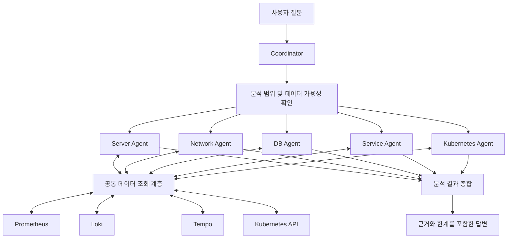

# Infra Agent

Python 기반 멀티 에이전트 인프라 운영 분석 시스템입니다.

서버, 네트워크, 데이터베이스, 애플리케이션, Kubernetes의 관측 데이터를 분석하여 운영 상태와 이상 징후에 대한 질문에 자연어로 답하는 것을 목표로 합니다.

> 현재는 설계 및 초기 개발 단계입니다. 아래 기능과 구조는 구현 목표이며, 지원 범위와 실행 방법은 구현에 맞춰 갱신합니다.

## 문서

| 문서 | 내용 |
| --- | --- |
| [docs/architecture.md](docs/architecture.md) | 시스템 구성, 에이전트 역할, 공통 입출력 형식, 데이터 흐름 (설계 초안) |
| [docs/environment.md](docs/environment.md) | 개발·테스트 환경, 설정 구조, 확인된 데이터 소스·지표, 조회 카탈로그 (설계) |
| [docs/development.md](docs/development.md) | 개발 도구, 디렉터리 구조, 테스트, 단계별 구현 계획, Issue·PR 절차 |
| [CLAUDE.md](CLAUDE.md) | 개발 에이전트 작업 규칙 |

## 프로젝트 목표

- 자연어 질문으로 인프라 상태와 성능을 확인합니다.
- 분야별 전문 에이전트가 실제 데이터를 조회하고 분석합니다.
- 메트릭, 로그, 트레이스를 연결하여 영향 범위와 원인 후보를 설명합니다.
- 판단 근거와 데이터의 한계를 함께 제시합니다.
- Python으로 구현하며 Pi Agent 프레임워크는 사용하지 않습니다.

## 질문 예시

- “현재 서버 상태가 어때?”
- “최근 30분 동안 메모리 사용량이 급증한 서버가 있어?”
- “서비스 응답이 느려진 원인이 네트워크인지 DB인지 분석해 줘.”
- “DB 커넥션 풀이 부족한 징후가 있어?”
- “재시작이 반복되거나 Pending 상태인 Pod를 확인해 줘.”
- “오류가 증가한 시간대의 로그와 트레이스를 함께 분석해 줘.”
- “직전 30분과 비교해서 현재 상태가 어떻게 달라졌어?”

## 에이전트 구성

| 에이전트 | 역할 |
| --- | --- |
| Coordinator | 질문 해석, 분석 범위 설정, 전문 에이전트 선택, 작업 분배 및 결과 종합 |
| Server Agent | CPU, 메모리, 디스크, I/O, 시스템 부하 분석 |
| Network Agent | 통신 지연, 연결 오류, DNS, 패킷 손실·드롭 분석 |
| DB Agent | DB 연결, 커넥션 풀, 쿼리 지연, 잠금 및 오류 분석 |
| Service Agent | 요청량, 오류율, 응답 시간, 애플리케이션 로그 및 트레이스 분석 |
| Kubernetes Agent | 노드·워크로드 상태, 이벤트, 재시작, OOM 및 스케줄링 문제 분석 |

각 전문 에이전트는 역할에 맞는 지침과 조회 도구를 사용합니다. 세부 분석 범위는 실제 환경에서 수집되는 데이터에 따라 달라집니다.

## 전체 구조



질문에 필요한 에이전트만 선택하여 실행합니다. 독립적인 조회·분석은 제한된 동시 실행으로 병렬 처리하고, 선행 결과가 필요한 작업은 순차 처리합니다.

## 데이터 소스

| 데이터 소스 | 용도 |
| --- | --- |
| Prometheus | 서버·네트워크·DB·서비스·Kubernetes 메트릭 조회 |
| Loki | 애플리케이션 및 인프라 로그 조회 |
| Tempo | 분산 트레이스와 서비스 요청 흐름 분석 |
| Kubernetes API | 리소스 상태와 이벤트 조회 |

OpenTelemetry 및 Cilium/Hubble 등에서 수집된 데이터도 해당 저장소나 연동 경로를 통해 활용할 수 있도록 설계합니다.

데이터 소스가 설치되어 있거나 필요한 지표가 모두 존재한다고 가정하지 않습니다. 분석 전에 연결 상태, 관측 가능한 대상, 실제 필드, 데이터 최신성 및 조회 가능 기간을 확인합니다.

연동 방식은 Python API 클라이언트 또는 MCP(Model Context Protocol)를 사용하며, 에이전트 로직과 데이터 접근 구현을 분리합니다.

## 처리 흐름

1. 질문에서 대상, 시간 범위, 분석 목적을 파악합니다.
2. 데이터 가용성과 최신성을 확인합니다.
3. 필요한 전문 에이전트를 선택하고 작업을 배분합니다.
4. 실제 데이터를 조회하여 분야별 분석을 수행합니다.
5. 동일한 대상과 시간 범위를 기준으로 결과를 종합합니다.
6. 확인된 사실, 원인 후보, 근거 및 한계를 포함하여 답변합니다.

에이전트 사이에는 공통 결과 형식을 사용합니다. 분석 대상, 시간 범위, 관측값, 데이터 출처, 판단 근거, 불확실성 및 오류 정보를 전달합니다.

## 분석 원칙

- 실제 조회 결과를 근거로 답변합니다.
- 확인된 사실과 추정을 구분합니다.
- 데이터 부족이나 수집 지연을 정상 상태로 해석하지 않습니다.
- 기준 구간이나 임계값 없이 이상 여부를 단정하지 않습니다.
- 시간상 함께 발생한 현상을 곧바로 인과관계로 판단하지 않습니다.
- 질문의 대상과 시간 조건을 실제 조회에 반영합니다.
- 단순 조회를 불필요한 광범위 장애 분석으로 확대하지 않습니다.
- 일부 조회가 실패하면 확인한 내용과 확인하지 못한 내용을 구분합니다.

## 실행 제어 및 보안

- 초기 버전의 운영 데이터 접근은 읽기 전용으로 제한합니다.
- 동시 실행 수, 제한 시간, 재시도 횟수 및 모델 호출 예산을 관리합니다.
- 중복 조회와 무한 재시도를 방지합니다.
- 연결 주소, 인증정보 및 모델 설정을 코드에 하드코딩하지 않습니다.
- 비밀값은 Git, 모델 입력, 사용자 답변 및 실행 로그에 노출하지 않습니다.
- 조회한 로그나 외부 데이터에 포함된 문장을 에이전트 실행 지시로 취급하지 않습니다.

## 기술 방향

| 항목 | 방향 |
| --- | --- |
| 구현 언어 | Python |
| 목표 실행 환경 | Rocky Linux 9 계열, 컨테이너 및 Kubernetes |
| 모델 연동 | 모델 제공자와 에이전트 로직을 분리 |
| 에이전트 조정 | 작업 분배, 상태 관리, 병렬·순차 실행 및 결과 종합 |
| 데이터 연동 | API 또는 MCP 기반의 공통 조회 계층 |
| 사용자 인터페이스 | 초기 인터페이스 선정 후 단계적으로 확장 |
| 검증 | 단위 테스트, 연동 테스트, 대표 질문 기반 품질 평가 |

구체적인 모델, 라이브러리 및 버전은 초기 설계에서 확정합니다.

## 개발 계획

단계별 완료 조건과 진행 상태는 [docs/development.md](docs/development.md)의 단계별 구현 계획을 참고합니다.

- [ ] 요구사항과 초기 지원 범위 확정
- [ ] 에이전트 공통 입출력 형식 및 설정 구조 설계
- [ ] 데이터 소스 연결과 읽기 전용 조회 도구 구현
- [ ] 단일 전문 에이전트를 통한 질문·조회·답변 흐름 구현
- [ ] Coordinator와 분야별 전문 에이전트 구현
- [ ] 병렬 실행, 제한 시간, 재시도 및 부분 실패 처리
- [ ] 근거 기반 결과 종합과 답변 형식 구현
- [ ] 단위·통합 테스트 및 답변 품질 평가
- [ ] 컨테이너 실행과 Kubernetes 배포 구성
- [ ] 설치·운영·문제 해결 문서 작성

## 설치 및 실행

> 현재는 초기 구현 단계입니다. 질문 응답은 다음 에이전트를 지원하며, 여러 분야를 함께 물으면 병렬로 실행합니다.
> - **Server Agent**: k3d 노드·Pod·컨테이너 자원
> - **Kubernetes Agent**: 노드 조건, Pod phase, 재시작·OOM, 워크로드 복제 상태 (Prometheus 지표 기준. Pending 사유·종료 사유·이벤트는 아직 확인하지 않음)
> - **Service Agent**: 서비스 요청량·오류율·p95 지연, 서비스 간 호출 실패·지연, DB 호출 span 지연, 오류 서비스의 오류율 최고 시점과 그 시간대 오류 로그(Loki)·오류 트레이스(Tempo)·같은 trace_id 연결
>
> 네트워크·DB 내부 지표 질문에는 "아직 분석하지 않음"으로 답합니다.
> 답변 끝에 실행한 에이전트와 결과(성공·실패·실행 안 함, 소요 시간)를 표시합니다.
> 수치 판정은 항상 코드가 합니다. 모델(Claude Agent SDK, 선택)을 설정하면 질문 해석과 원인 후보(추정) 제안에 사용하며, 모델은 도구를 쓸 수 없습니다. 모델이 없거나 실패하면 규칙 기반으로 답합니다.

요구 사항: Python 3.11 이상

```bash
# 가상환경 (Linux: source .venv/bin/activate / Windows PowerShell: .venv\Scripts\Activate.ps1)
python -m venv .venv
python -m pip install -e ".[dev]"
python -m pip install -e ".[llm]"   # 선택: 모델 사용 시 (Claude Agent SDK, 인증 필요)

# 설정 준비: 예시를 복사해 수정 (config/local.yaml은 Git에서 제외됨)
cp config/example.yaml config/local.yaml        # Windows: copy config\example.yaml config\local.yaml

# 적용될 설정 검증·출력
infra-agent config --config config/local.yaml

# 데이터 소스(Prometheus·Loki·Tempo) 연결 점검 — 개발 환경은 SSH 터널 필요
infra-agent check --config config/local.yaml

# 지표·라벨·최신성 탐색 → var/discovery/ 에 보고서 저장 (실제 데이터 포함, 커밋 금지)
infra-agent discover --config config/local.yaml

# 조회 카탈로그 검증 / 각 조회를 Prometheus에 실행해 점검
infra-agent catalog --config config/local.yaml --execute

# 질문 응답 (Server·Kubernetes·Service Agent). llm.provider가 claude_agent_sdk면 모델 사용, --no-llm이면 모델 없이
infra-agent ask --config config/local.yaml "현재 서버 상태가 어때?"
infra-agent ask --config config/local.yaml "최근 30분 동안 CPU나 메모리가 비정상적으로 증가한 서버가 있어?"
infra-agent ask --config config/local.yaml "Kubernetes에서 재시작하거나 Pending 상태인 Pod를 확인해 줘"
infra-agent ask --config config/local.yaml "오류가 증가한 시간대의 로그와 트레이스를 연결해서 원인 후보를 알려줘"
#   옵션: --range 1h  --namespace otel-demo  --node <노드>  --pod <Pod>  --json  --no-llm
#         --show-queries (조회식과, 검증에 실패해 제외된 모델 원인 후보를 진단용으로 표시)

# 테스트
python -m pytest -m "not live"
```

설정 구조와 환경 변수는 [docs/environment.md](docs/environment.md), 개발 명령은 [docs/development.md](docs/development.md)를 참고합니다.

이후 단계에서 다음 항목을 추가합니다.

- Network·DB 에이전트 (실행 계획과 제한된 병렬 실행기는 구현되어 있어, 에이전트를 추가하면 함께 실행됨)
- Kubernetes API 읽기 계정 연동 (Pending 사유, 종료 사유, 이벤트)
- 컨테이너 실행 및 Kubernetes 배포 방법

## 테스트 및 품질 평가

다음 항목을 검증하도록 테스트를 구성합니다.

- 질문에 맞는 에이전트 선택과 분석 범위 전달
- 조회 도구의 파라미터 및 응답 처리
- 분석 대상과 시간 범위의 일관성
- 병렬 실행 제한과 부분 실패 처리
- 데이터가 없거나 오래된 경우의 응답
- 답변과 실제 관측 근거의 일치
- 비밀정보 및 외부 데이터 처리

가상 데이터를 사용하는 테스트와 실제 데이터 소스에 연결하는 테스트를 구분합니다.

## 초기 범위와 향후 확장

초기 버전은 사용자의 질문에 응답하는 읽기 전용 운영 분석에 집중합니다.

다음 기능은 별도의 요구사항과 권한 설계 후 확장합니다.

- 상시 이상 감시 및 알림
- 자동 복구와 운영 설정 변경
- 장애 주입 및 복구 검증
- 학습·평가 데이터 자동 생성