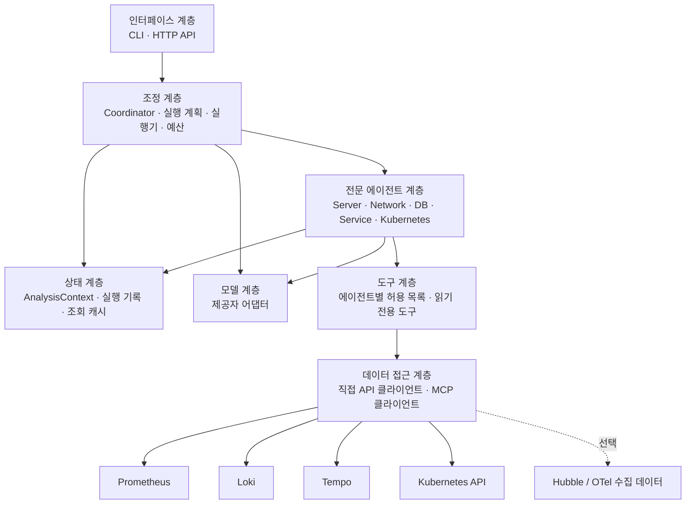
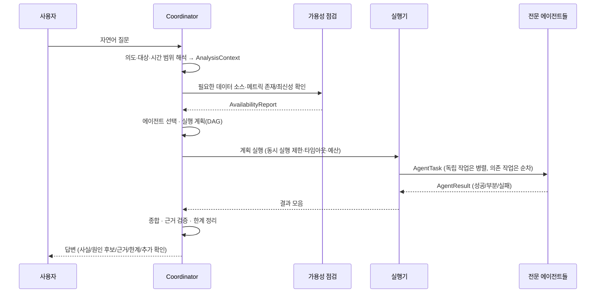

# 아키텍처 설계

> **상태: 설계 초안.** 이 문서의 구성 요소, 인터페이스, 스키마는 아직 구현되지 않았습니다.
> 구현이 진행되면 각 절에 구현 상태를 표시하고, 설계와 달라진 부분을 이 문서에 반영합니다.
> 기능 범위의 기준은 [README.md](../README.md)입니다.

## 1. 목적과 범위

사용자가 자연어로 서버, 네트워크, 데이터베이스, 서비스, Kubernetes의 상태나 이상 징후를 질문하면,
분야별 전문 에이전트가 실제 관측 데이터를 **읽기 전용으로** 조회·분석하고 근거와 한계를 포함한 통합 답변을 제공합니다.

| 구분 | 내용 |
| --- | --- |
| 초기 범위 | 상태 조회, 시간 구간 비교, 이상 징후 탐지, 영향 범위 분석, 근거 기반 원인 후보 제시 |
| 초기 범위 제외 | 상시 감시·알림, 자동 복구·설정 변경, 장애 주입, 학습 데이터 생성 |
| 사용하지 않는 것 | Pi Agent 프레임워크와 Pi 실행 환경 |

## 2. 계층 구성

에이전트 조정, 모델 호출, 데이터 조회, 상태 관리, 사용자 인터페이스를 분리합니다.
상위 계층은 하위 계층의 **인터페이스**에만 의존하며, 특정 모델 제공자나 데이터 소스 구현에 직접 의존하지 않습니다.



| 계층 | 책임 | 비고 |
| --- | --- | --- |
| 인터페이스 | 질문 입력, 답변 출력, 실행 옵션 전달 | 초기 CLI, 이후 HTTP API 제안 |
| 조정 | 의도·대상·시간 해석, 가용성 확인, 에이전트 선택, 실행 계획(DAG), 결과 종합 | Coordinator |
| 전문 에이전트 | 분야별 지침·도구로 조회하고 분석 결과를 공통 형식으로 반환 | 5개 에이전트 |
| 상태 | 요청 단위 컨텍스트, 조회 결과·근거 저장, 중복 조회 캐시 | 초기에는 요청 범위 메모리 |
| 모델 | 제공자별 API 차이를 숨기는 어댑터, 구조화 출력, 호출 예산 계측 | 제공자 미확정 |
| 도구 | 에이전트가 호출 가능한 읽기 전용 조회 함수, 파라미터 검증, 결과 크기 제한 | 쓰기 도구 없음 |
| 데이터 접근 | 데이터 소스 연결, 인증, 타임아웃, 재시도, 응답 정규화 | API 또는 MCP 구현 교체 가능 |

## 3. 에이전트 역할

각 에이전트는 **별도의 역할 지침, 허용 도구 목록, 분야별 결정적(deterministic) 분석 코드, 출력 검증**을 갖습니다.
하나의 모델 호출에서 역할 이름만 바꿔 답하는 방식은 사용하지 않습니다.

분석은 두 단계로 나눕니다.

1. **결정적 분석(Python 코드):** 조회, 집계, 기준 구간 비교, 임계값 판정, 상위 N 추출. 숫자 계산은 모델에 맡기지 않습니다.
2. **해석(모델):** 결정적 분석 결과와 근거를 입력으로 받아 의미, 원인 후보, 추가 확인 사항을 정리합니다. 모델이 언급한 수치는 근거 ID로 추적 가능해야 합니다.

| 에이전트 | 주요 분석 | 주요 데이터 소스 (가용 시) | 허용 도구 예시 |
| --- | --- | --- | --- |
| Coordinator | 의도·대상·시간 해석, 에이전트 선택, 작업 순서, 결과 종합, 충돌·누락 표시 | 각 에이전트 결과, 가용성 점검 결과 | 가용성 점검, 대상 해석(라벨 값 조회) |
| Server | CPU, 메모리, 디스크 사용률, I/O, load, 파일시스템 여유 | Prometheus(node_exporter 계열) | `prom_query`, `prom_query_range`, `prom_series` |
| Network | 지연, 연결 오류, 재전송, DNS 오류, 패킷 드롭, 서비스 간 흐름 | Prometheus(node/blackbox/Hubble 메트릭), Hubble(선택) | `prom_*`, `hubble_flows`(선택) |
| DB | 연결 오류, 커넥션 풀 사용률·대기, 쿼리 지연, 잠금 | Prometheus(DB exporter, 애플리케이션 풀 메트릭), Loki, Tempo DB span | `prom_*`, `loki_query_range`, `tempo_search` |
| Service | 요청량, 오류율, 응답 시간(분위수), 로그 오류 패턴, 느린·실패 트레이스 | Prometheus(HTTP/gRPC 메트릭), Loki, Tempo | `prom_*`, `loki_*`, `tempo_search`, `tempo_trace` |
| Kubernetes | 노드 조건, Pod 상태·재시작·OOMKilled, Pending 사유, 이벤트, 요청·제한 | Kubernetes API, Prometheus(kube-state-metrics, cAdvisor) | `k8s_list`, `k8s_get`, `k8s_events`, `prom_*` |

실제 사용할 메트릭 이름과 라벨은 환경마다 다르므로 코드에 고정하지 않고, 가용성 점검 결과와 설정 가능한 **쿼리 카탈로그**를 통해 결정합니다(7절).

## 4. 처리 흐름



### 4.1 질문 해석

- **의도 유형:** `status`(상태 조회), `compare`(구간 비교), `anomaly`(이상 탐지), `impact`(영향 범위), `root_cause`(원인 후보).
- **대상:** 호스트, 네임스페이스, 워크로드, 서비스, DB 인스턴스 등. 이름은 실제 라벨 값이나 Kubernetes 리소스 조회로 해석하고, 모호하면 후보를 제시합니다.
- **시간 범위:** 모든 범위는 절대 시각(UTC, 시작·끝)으로 정규화해 모든 에이전트가 공유합니다.
  - 기본값(제안): 명시가 없으면 최근 30분.
  - "직전 30분과 비교": 현재 구간 `[now-30m, now]`, 기준 구간 `[now-60m, now-30m]`.
- 해석 결과는 답변에 명시해 사용자가 범위를 확인할 수 있게 합니다.

### 4.2 에이전트 선택 예시

| 질문 | 선택 | 실행 방식 |
| --- | --- | --- |
| "현재 서버 상태가 어때?" | Server | 단일 |
| "최근 30분 CPU나 메모리가 비정상 증가한 서버?" | Server | 단일 (기준 구간 비교) |
| "응답이 느려진 이유가 네트워크인지 DB인지" | Service → (Network ∥ DB) | Service로 대상·시간 확정 후 병렬 |
| "DB 커넥션 풀 부족이나 쿼리 지연 징후?" | DB | 단일 |
| "재시작하거나 Pending인 Pod 확인" | Kubernetes | 단일 |
| "오류 증가 시간대의 로그와 트레이스 연결" | Service (필요 시 → Kubernetes/DB) | 순차 |
| "직전 30분과 비교해 무엇이 달라졌나" | 가용한 분야 중 질문 대상 관련 에이전트 | 병렬 |

단순 조회 질문을 광범위한 장애 분석으로 확장하지 않습니다. 확장이 필요하다고 판단되면 답변의 "추가 확인 사항"으로 제안합니다.

### 4.3 데이터 가용성 점검

분석 전에 다음을 확인하고 결과를 `AvailabilityReport`로 보관합니다.

| 항목 | 확인 방법 (예) |
| --- | --- |
| 연결 가능 여부 | Prometheus `/-/ready`·`/api/v1/status/buildinfo`, Loki `/ready`, Tempo `/ready`, Kubernetes `/version` |
| 수집 대상 | Prometheus `/api/v1/targets`, `up` 시계열, Loki 라벨 값, Kubernetes 네임스페이스 |
| 실제 메트릭·라벨·필드 | Prometheus `/api/v1/series`, `/api/v1/labels`, Loki `/loki/api/v1/labels`, Tempo 태그 검색 |
| 최신성 | 최신 샘플 시각과 현재 시각의 차이(예: `time() - timestamp(metric)`) |
| 조회 가능 기간 | 요청 범위 시작 시점 데이터 존재 여부 확인 |

필요한 지표가 없으면 해당 분석을 "확인 불가"로 표시하고 필요한 수집 설정(예: exporter, 애플리케이션 계측)을 제안합니다. **데이터가 없다는 사실을 정상으로 해석하지 않습니다.**

## 5. 공통 입출력 형식 (초안)

아래는 스키마 초안입니다. 구현 시 Pydantic 모델 등으로 정의하고 이 절을 갱신합니다.

```text
AnalysisContext            # 요청 단위로 Coordinator가 생성, 모든 에이전트가 공유(읽기 전용)
  request_id: str
  question: str
  intent: status | compare | anomaly | impact | root_cause
  time_range: {start: datetime(UTC), end: datetime(UTC), step: duration}
  baseline_range: {start, end} | null
  targets: [TargetRef]        # 공통 대상 식별자
  budget: {max_llm_calls, max_tool_calls, deadline}

TargetRef
  kind: host | node | namespace | workload | pod | service | database
  name: str
  labels: {str: str}          # 실제 조회에 사용한 라벨 매칭 기준

AgentTask
  task_id: str
  agent: server | network | db | service | kubernetes
  objective: str              # 이 에이전트가 답할 구체적 질문
  depends_on: [task_id]
  inputs: {…}                 # 선행 작업에서 받은 대상·시간 등

ToolResult                    # 모든 조회 결과. 근거(Evidence)의 원천
  evidence_id: str
  source: prometheus | loki | tempo | kubernetes | hubble
  query: str                  # 실행한 조회식(비밀값 제외)
  time_range: {start, end}
  status: ok | empty | error | timeout | truncated
  data: …                     # 정규화된 결과(크기 제한)
  freshness_seconds: float | null
  fetched_at: datetime

Finding
  kind: fact | hypothesis     # 확인된 사실 / 원인 후보
  statement: str
  severity: info | warning | critical
  targets: [TargetRef]
  evidence_ids: [str]         # 반드시 실제 ToolResult를 가리킴
  basis: threshold | baseline | state | correlation
  confidence: low | medium | high   # hypothesis에만 의미

AgentResult
  task_id, agent
  status: success | partial | failed | skipped
  findings: [Finding]
  limitations: [str]          # 데이터 부족, 수집 지연, 조회 실패 등
  next_checks: [str]
  errors: [{code, message}]   # 비밀값 제거된 메시지
  usage: {llm_calls, tool_calls, elapsed_ms}

FinalAnswer
  summary: str
  current_state, anomalies, impact, facts, hypotheses
  evidence: [{source, query, time_range, key_values}]
  limitations, unverified_areas, next_checks
```

## 6. 분석·판단 원칙

- 이상 여부는 **관측값 + 판단 기준**(설정 임계값, 기준 구간 대비 변화, 리소스 상태값)으로만 판정하고 `basis`에 기록합니다.
- 시간상 동시 발생은 `basis: correlation`의 `hypothesis`로만 표현하며 인과관계로 확정하지 않습니다.
- 모든 수치와 주장은 `evidence_ids`로 실제 조회 결과를 가리켜야 합니다. 종합 단계에서 근거 없는 Finding은 제외하거나 추정으로 강등합니다.
- 조회하지 않은 값, 존재하지 않는 메트릭·로그·트레이스를 생성하지 않습니다.
- 일부 에이전트가 실패하면 성공한 분석과 확인하지 못한 영역을 구분해 답변합니다.

## 7. 데이터 접근 계층

```text
DataSource (인터페이스)
  ├─ PrometheusSource   : query, query_range, series, labels, targets
  ├─ LokiSource         : query_range, labels, label_values
  ├─ TempoSource        : search, get_trace, tags
  ├─ KubernetesSource   : list, get, events (get/list/watch 권한만)
  └─ HubbleSource       : flows (선택)
구현 방식: DirectHttpClient | McpClient  — 설정으로 선택
```

- 에이전트는 데이터 소스 구현이 아니라 **도구 인터페이스**만 사용합니다.
- **쿼리 카탈로그(설정 파일):** 분석 항목(예: `server.cpu_usage`)별 후보 PromQL/LogQL/TraceQL을 정의하고, 가용성 점검에서 실제로 존재하는 후보를 선택합니다. 환경별 메트릭 이름 차이를 코드 수정 없이 흡수하기 위함입니다.
- 결과 크기 제한(시계열 수, 로그 줄 수, 트레이스 수)과 요약을 적용해 모델 입력량을 통제합니다.
- 연결 주소, 인증정보, 모델 설정은 환경 변수 또는 마운트된 설정/Secret에서 읽습니다.

## 8. 실행 제어

| 항목 | 설계 |
| --- | --- |
| 동시 실행 | 전역 세마포어로 에이전트·도구 동시 실행 수 제한 |
| 제한 시간 | 요청 전체 deadline, 에이전트별 타임아웃, 도구 호출별 타임아웃 |
| 재시도 | 일시 오류(연결 오류, 5xx, 429)만 제한 횟수·지수 백오프로 재시도. 쿼리 오류(4xx)는 재시도하지 않음 |
| 모델 호출 예산 | 요청당 모델 호출 수·토큰 상한, 에이전트별 도구 호출 루프 상한 |
| 중복 조회 방지 | `(source, query, time_range)` 키의 요청 범위 캐시 |
| 부분 실패 | 실패·타임아웃 에이전트는 `failed`로 기록하고 나머지 결과로 종합 |

## 9. 보안

- **읽기 전용:** 도구 계층에 쓰기 작업을 제공하지 않습니다. Kubernetes는 `get/list/watch`만 허용하는 전용 ServiceAccount/RBAC를 사용하고 `secrets` 리소스 조회 권한은 부여하지 않습니다.
- **비밀값 보호:** 인증정보를 코드·Git·모델 입력·답변·로그에 남기지 않습니다. 로그 출력 전에 토큰·비밀번호 패턴을 마스킹합니다.
- **외부 데이터 격리:** 조회된 로그, 이벤트 메시지, 트레이스 속성은 **데이터**로만 취급합니다. 모델 입력에서 구분자로 격리하고, 그 안의 문장을 실행 지시로 따르지 않도록 지침에 명시합니다. 도구 허용 목록은 코드에서 강제되므로 데이터 내용으로 권한이 확장되지 않습니다.

## 10. 기술 선택지 (미확정)

모델 제공자와 멀티 에이전트 라이브러리는 확정되지 않았습니다. 아래는 비교 후보와 판단 기준입니다.

### 10.1 모델 제공자

| 후보 | 장점 | 고려 사항 |
| --- | --- | --- |
| 상용 API (Anthropic Claude, OpenAI 등) | 도구 호출·구조화 출력 품질 | 외부 전송 데이터 범위, 비용, 네트워크 정책 |
| 자체 호스팅 (vLLM·Ollama 등 + 오픈 모델) | 데이터 내부 유지 | GPU 자원, 도구 호출 품질 검증 필요 |
| 게이트웨이 (LiteLLM 등) | 여러 제공자 교체 용이 | 추가 구성 요소 |

판단 기준: 도구 호출·JSON 출력 안정성, 한국어 품질, 운영 데이터 외부 전송 허용 여부, 비용·지연. 어떤 선택이든 **모델 계층 어댑터**로 감싸 교체 가능하게 합니다.

### 10.2 에이전트 조정 방식

| 후보 | 장점 | 고려 사항 |
| --- | --- | --- |
| 자체 경량 오케스트레이터 (asyncio + 명시적 DAG) | 병렬·순차·예산·부분 실패를 직접 통제, 의존성 최소 | 구현·유지 비용 |
| LangGraph | 그래프 기반 상태·분기, 체크포인트 | 추상화 학습 비용, 버전 변화 |
| OpenAI Agents SDK / Claude Agent SDK | 도구 루프·핸드오프 기본 제공 | 특정 제공자 친화적 |
| AutoGen(AG2), CrewAI | 다중 에이전트 대화 패턴 | 대화 중심 구조가 결정적 실행 제어와 맞지 않을 수 있음 |

초기 제안: 요구사항의 핵심이 **결정적 실행 제어**(동시 실행 수, 타임아웃, 예산, 부분 실패)이므로 자체 경량 오케스트레이터로 최소 기능을 만들고, 에이전트 내부 도구 호출 루프만 모델 계층에 의존하는 방식을 우선 검토합니다. 1단계 구현 전에 확정하고 이 절을 갱신합니다.

### 10.3 기타

- 데이터 접근: `httpx`(비동기 HTTP), 공식 `kubernetes` Python 클라이언트, MCP는 공식 `mcp` Python SDK 후보.
- 스키마: Pydantic 후보.
- 인터페이스: 초기 CLI, 이후 FastAPI 기반 HTTP API 후보.

## 11. 미확정 사항

| 항목 | 영향 | 결정 시점(제안) |
| --- | --- | --- |
| 모델 제공자와 운영 데이터 외부 전송 허용 범위 | 모델 계층, 보안 설계 | 1단계 전 |
| 에이전트 조정 라이브러리 | 조정 계층 구조 | 1단계 전 |
| 대상 환경의 데이터 소스 설치 여부·버전·인증 방식 | 데이터 접근 계층, 쿼리 카탈로그 | 연동 단계 전 |
| DB 종류와 수집 가능한 DB 지표 | DB 에이전트 범위 | DB 에이전트 구현 전 |
| Hubble/OTel 데이터 경로 | Network·Service 에이전트 범위 | 해당 에이전트 구현 전 |
| 사용자 인터페이스 형태 | 인터페이스 계층 | 2단계 |
| 기본 시간 범위·임계값 기본값 | 판정 결과 | 설정 설계 시 |
| 대화 이력(후속 질문) 지원 여부 | 상태 계층 | 초기 범위 확정 시 |
