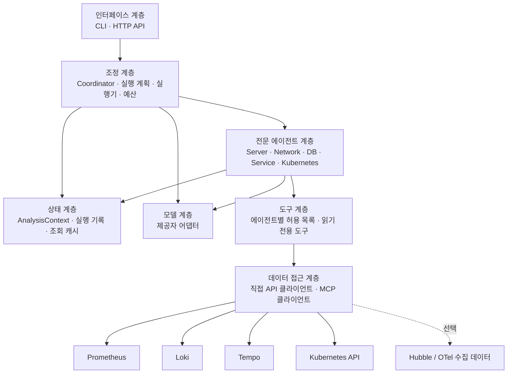
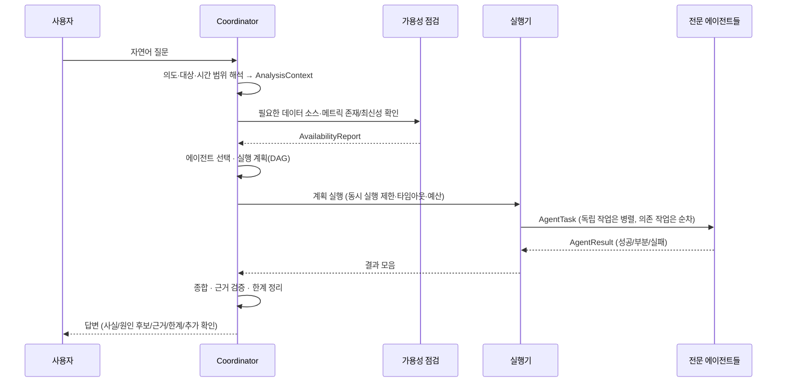

# 아키텍처 설계

> **상태: 설계 초안.** 공통 스키마(5절)·설정 모델(#5)과 데이터 접근 계층 일부(7절: Prometheus·Loki·Tempo 읽기 전용 클라이언트, 연결 점검, 조회 카탈로그 로더, #7)가 구현되었습니다. 도구 계층, 에이전트, 조정·모델 계층은 아직 구현되지 않았습니다.
> 구현이 진행되면 각 절에 구현 상태를 표시하고, 설계와 달라진 부분을 이 문서에 반영합니다.
> 기능 범위의 기준은 [README.md](../README.md)입니다.

## 1. 목적과 범위

사용자가 자연어로 서버, 네트워크, 데이터베이스, 서비스, Kubernetes의 상태나 이상 징후를 질문하면,
분야별 전문 에이전트가 실제 관측 데이터를 **읽기 전용으로** 조회·분석하고 근거와 한계를 포함한 통합 답변을 제공합니다.

| 구분 | 내용 |
| --- | --- |
| 초기 범위 | 상태 조회, 시간 구간 비교, 이상 징후 탐지, 영향 범위 분석, 근거 기반 원인 후보 제시 |
| 초기 범위 제외 | 상시 감시·알림, 자동 복구·설정 변경, 장애 주입, 학습 데이터 생성 |
| 사용하지 않는 것 | Pi Agent 프레임워크와 Pi 실행 환경 |

## 2. 계층 구성

에이전트 조정, 모델 호출, 데이터 조회, 상태 관리, 사용자 인터페이스를 분리합니다.
상위 계층은 하위 계층의 **인터페이스**에만 의존하며, 특정 모델 제공자나 데이터 소스 구현에 직접 의존하지 않습니다.



| 계층 | 책임 | 비고 |
| --- | --- | --- |
| 인터페이스 | 질문 입력, 답변 출력, 실행 옵션 전달 | 초기 CLI, 이후 HTTP API 제안 |
| 조정 | 의도·대상·시간 해석, 가용성 확인, 에이전트 선택, 실행 계획(DAG), 결과 종합 | Coordinator |
| 전문 에이전트 | 분야별 지침·도구로 조회하고 분석 결과를 공통 형식으로 반환 | 5개 에이전트 |
| 상태 | 요청 단위 컨텍스트, 조회 결과·근거 저장, 중복 조회 캐시 | 초기에는 요청 범위 메모리 |
| 모델 | 제공자별 API 차이를 숨기는 어댑터, 구조화 출력, 호출 예산 계측 | 제공자 미확정 |
| 도구 | 에이전트가 호출 가능한 읽기 전용 조회 함수, 파라미터 검증, 결과 크기 제한 | 쓰기 도구 없음 |
| 데이터 접근 | 데이터 소스 연결, 인증, 타임아웃, 재시도, 응답 정규화 | API 또는 MCP 구현 교체 가능 |

## 3. 에이전트 역할

각 에이전트는 **별도의 역할 지침, 허용 도구 목록, 분야별 결정적(deterministic) 분석 코드, 출력 검증**을 갖습니다.
하나의 모델 호출에서 역할 이름만 바꿔 답하는 방식은 사용하지 않습니다.

분석은 두 단계로 나눕니다.

1. **결정적 분석(Python 코드):** 조회, 집계, 기준 구간 비교, 임계값 판정, 상위 N 추출. 숫자 계산은 모델에 맡기지 않습니다.
2. **해석(모델):** 결정적 분석 결과와 근거를 입력으로 받아 의미, 원인 후보, 추가 확인 사항을 정리합니다. 모델이 언급한 수치는 근거 ID로 추적 가능해야 합니다.

아래 표의 "초기 데이터"는 개발 환경(OTel Demo, k3d)에서 사용자가 확인한 범위이며, 상세 지표와 검증 상태는 [environment.md](environment.md) 3절을 기준으로 합니다.

| 에이전트 | 주요 분석 | 초기 데이터 (개발 환경) | 허용 도구 예시 |
| --- | --- | --- | --- |
| Coordinator | 의도·대상·시간 해석, 에이전트 선택, 작업 순서, 결과 종합, 충돌·누락 표시 | 각 에이전트 결과, 가용성 점검 결과 | 가용성 점검, 대상 해석(라벨 값 조회) |
| Server | **초기 대상은 k3d 노드·Pod·컨테이너 자원**: CPU, 메모리 working set, (가용 시) 파일시스템·네트워크 I/O | Prometheus `k8s_node_*`, `container_*` (kubeletstats, cAdvisor) | `prom_query`, `prom_query_range`, `prom_series` |
| Network | 패킷 드롭과 사유, DNS 질의·오류, (가용 시) 서비스 간 흐름 | Prometheus `hubble_*` | `prom_*` (Hubble Relay 직접 조회는 미확인) |
| DB | PostgreSQL 연결 수 대비 최대치, 데드락, DB 크기, 앱 커넥션 풀 사용률·대기, DB 작업 지연 분위수 | Prometheus `postgresql_*`, `db_client_*`, `db_sql_*`; Loki 앱 로그; Tempo DB span(검증 필요) | `prom_*`, `loki_query_range`, `tempo_search` |
| Service | 요청량, 오류율, 응답 시간(분위수), 로그 오류 패턴, 느린·실패 트레이스 | Loki, Tempo; Prometheus 요청 지표는 탐색으로 확인 | `prom_*`, `loki_*`, `tempo_search`, `tempo_trace` |
| Kubernetes | 노드 조건, Pod 상태·재시작·OOMKilled, Pending 사유, 이벤트, 요청·제한 | Prometheus `k8s_*`(k8s_cluster 수집); 이벤트(수집 위치 검증 필요); Kubernetes API는 읽기 계정 준비 후 | `prom_*`, `loki_*`, (이후) `k8s_list`, `k8s_get`, `k8s_events` |

범위 제한:

- `node_*`, `kube_*` 지표는 개발 환경에서 확인되지 않았으므로 가정하지 않습니다.
- `system_*` 지표는 수집 범위가 검증되기 전까지 물리 서버 전체 값으로 해석하지 않습니다. 물리 서버 전체 성능 분석은 별도 수집 확인 후 확장합니다.
- DB는 PostgreSQL 직접 SQL 접속 없이 관측 데이터로 분석합니다. `pg_stat_statements`, 실행 계획, 상세 잠금 그래프, Valkey 지표는 가용성이 확인되지 않았습니다.
- Server와 Kubernetes의 경계: Server는 자원 **사용량**, Kubernetes는 리소스 **상태·이벤트·스케줄링·요청/제한**을 담당합니다.

실제 사용할 지표 이름과 라벨은 코드에 고정하지 않고, 실제 지표 탐색 결과로 만든 **조회 카탈로그**를 통해 결정합니다(7절).

## 4. 처리 흐름



### 4.1 질문 해석

- **의도 유형:** `status`(상태 조회), `compare`(구간 비교), `anomaly`(이상 탐지), `impact`(영향 범위), `root_cause`(원인 후보).
- **대상:** 호스트, 네임스페이스, 워크로드, 서비스, DB 인스턴스 등. 이름은 실제 라벨 값이나 Kubernetes 리소스 조회로 해석하고, 모호하면 후보를 제시합니다.
- **시간 범위:** 모든 범위는 절대 시각(UTC, 시작·끝)으로 정규화해 모든 에이전트가 공유합니다.
  - 기본값(제안): 명시가 없으면 최근 30분.
  - "직전 30분과 비교": 현재 구간 `[now-30m, now]`, 기준 구간 `[now-60m, now-30m]`.
- 해석 결과는 답변에 명시해 사용자가 범위를 확인할 수 있게 합니다.

### 4.2 에이전트 선택 예시

| 질문 | 선택 | 실행 방식 |
| --- | --- | --- |
| "현재 서버 상태가 어때?" | Server (초기에는 k3d 노드 기준으로 답하고 범위를 명시) | 단일 |
| "최근 30분 CPU나 메모리가 비정상 증가한 서버?" | Server (노드·Pod·컨테이너) | 단일 (기준 구간 비교) |
| "응답이 느려진 이유가 네트워크인지 DB인지" | Service → (Network ∥ DB) | Service로 대상·시간 확정 후 병렬 |
| "DB 커넥션 풀 부족이나 쿼리 지연 징후?" | DB | 단일 |
| "재시작하거나 Pending인 Pod 확인" | Kubernetes | 단일 |
| "오류 증가 시간대의 로그와 트레이스 연결" | Service (필요 시 → Kubernetes/DB) | 순차 |
| "직전 30분과 비교해 무엇이 달라졌나" | 가용한 분야 중 질문 대상 관련 에이전트 | 병렬 |

단순 조회 질문을 광범위한 장애 분석으로 확장하지 않습니다. 확장이 필요하다고 판단되면 답변의 "추가 확인 사항"으로 제안합니다.

### 4.3 데이터 가용성 점검

분석 전에 다음을 확인하고 결과를 `AvailabilityReport`로 보관합니다.

| 항목 | 확인 방법 (예) |
| --- | --- |
| 연결 가능 여부 | Prometheus `/-/ready`·`/api/v1/status/buildinfo`, Loki `/ready`, Tempo `/ready`, Kubernetes `/version` |
| 수집 대상 | Prometheus `/api/v1/targets`, `up` 시계열, Loki 라벨 값, Kubernetes 네임스페이스 |
| 실제 메트릭·라벨·필드 | Prometheus `/api/v1/series`, `/api/v1/labels`, Loki `/loki/api/v1/labels`, Tempo 태그 검색 |
| 최신성 | 최신 샘플 시각과 현재 시각의 차이(예: `time() - timestamp(metric)`) |
| 조회 가능 기간 | 요청 범위 시작 시점 데이터 존재 여부 확인 |

필요한 지표가 없으면 해당 분석을 "확인 불가"로 표시하고 필요한 수집 설정(예: exporter, 애플리케이션 계측)을 제안합니다. **데이터가 없다는 사실을 정상으로 해석하지 않습니다.**

## 5. 공통 입출력 형식

> **구현됨 (#5):** `src/infra_agent/schemas/models.py`가 기준입니다. 아래는 요약이며, 필드가 다르면 코드가 우선합니다.
> 모든 모델은 불변(frozen)이고 정의되지 않은 필드를 거부합니다. 모든 시각은 UTC timezone-aware datetime입니다.

```text
TimeRange                  # start < end, UTC. last(duration, now), previous()(같은 길이의 직전 구간)
TargetRef                  # kind: host|node|namespace|workload|pod|container|service|database, name, labels

AnalysisContext            # 요청 단위로 Coordinator가 생성, 모든 에이전트가 읽기 전용으로 공유
  request_id, question
  intent: status | compare | anomaly | impact | root_cause
  time_range: TimeRange, step_seconds
  baseline_range: TimeRange | null      # intent=compare이면 필수
  targets: [TargetRef]
  budget: {max_llm_calls, max_tool_calls, deadline}

AgentTask
  task_id, agent: server|network|db|service|kubernetes|coordinator, objective
  depends_on: [task_id]                 # 자기 자신 의존 금지
  inputs: {…}

ToolResult                 # 모든 조회 결과. 근거(evidence)의 원천
  evidence_id, source: prometheus|loki|tempo|kubernetes|hubble
  query                    # 실행한 조회식(비밀값 제외)
  time_range, status: ok|empty|error|timeout|truncated
  data, freshness_seconds, fetched_at, error
  synthetic: bool          # 테스트용 가상 데이터 여부

Finding
  kind: fact | hypothesis
  statement, severity: info|warning|critical, targets
  evidence_ids: [str]      # 1개 이상 필수
  basis: threshold | baseline | state | correlation
  confidence: low|medium|high   # hypothesis에 필수, fact에는 금지
  # 규칙: basis=correlation은 fact가 될 수 없음

AgentResult
  task_id, agent, status: success|partial|failed|skipped
  findings, evidence: [ToolResult]   # findings의 evidence_ids는 evidence에 존재해야 함
  limitations, next_checks, errors: [{code, message}], usage: {llm_calls, tool_calls, elapsed_ms}
  # 규칙: failed에는 findings 금지, failed/partial에는 errors 또는 limitations 필수

FinalAnswer
  request_id, summary, time_range
  facts: [Finding(fact)], hypotheses: [Finding(hypothesis)]
  evidence: [{source, query, time_range, key_values}]
  limitations, unverified_areas, next_checks
```

"현재 상태·이상 징후·영향 범위"는 별도 필드가 아니라 `summary`와 Finding(`severity`, `targets`)으로 표현합니다. 답변 형식이 확정되는 12단계에서 필요하면 필드를 추가합니다.

## 6. 분석·판단 원칙

- 이상 여부는 **관측값 + 판단 기준**(설정 임계값, 기준 구간 대비 변화, 리소스 상태값)으로만 판정하고 `basis`에 기록합니다.
- 시간상 동시 발생은 `basis: correlation`의 `hypothesis`로만 표현하며 인과관계로 확정하지 않습니다.
- 모든 수치와 주장은 `evidence_ids`로 실제 조회 결과를 가리켜야 합니다. 종합 단계에서 근거 없는 Finding은 제외하거나 추정으로 강등합니다.
- 조회하지 않은 값, 존재하지 않는 메트릭·로그·트레이스를 생성하지 않습니다.
- 일부 에이전트가 실패하면 성공한 분석과 확인하지 못한 영역을 구분해 답변합니다.

## 7. 데이터 접근 계층

> **일부 구현 (#7):** `src/infra_agent/datasources/` — 공통 HTTP 기반(`http.py`: GET 전용, 허용 경로 목록, 일시 오류만 재시도, 토큰 마스킹), `prometheus.py`(ready·buildinfo·runtimeinfo·지표/라벨/메타데이터·query·query_range·selector 이스케이프), `loki.py`·`tempo.py`(탐색용 최소 기능), `probe.py`(연결 점검). Kubernetes·Hubble·MCP 경로와 도구 계층은 아직 없습니다.

```text
DataSource (인터페이스)
  ├─ PrometheusSource   : query, query_range, series, labels, targets
  ├─ LokiSource         : query_range, labels, label_values
  ├─ TempoSource        : search, get_trace, tags
  ├─ KubernetesSource   : list, get, events (get/list/watch 권한만)
  └─ HubbleSource       : flows (선택)
구현 방식: DirectHttpClient | McpClient  — 설정으로 선택
```

- 에이전트는 데이터 소스 구현이 아니라 **도구 인터페이스**만 사용합니다.
- **조회 카탈로그(설정 파일):** 분석 항목(예: `node.cpu_usage`)별 PromQL/LogQL/TraceQL, 필요한 지표, 라벨 매핑, 검증 상태를 환경별 파일로 정의합니다. 가용성 점검에서 필요한 지표가 실제로 존재하는 항목만 실행합니다. 카탈로그는 탐색 명령의 결과를 사람이 검토해 구성합니다. 형식과 탐색 절차는 [environment.md](environment.md) 4절을 따릅니다.
- 결과 크기 제한(시계열 수, 로그 줄 수, 트레이스 수)과 요약을 적용해 모델 입력량을 통제합니다.
- 연결 주소, 인증정보, 모델 설정은 환경 변수 또는 마운트된 설정/Secret에서 읽습니다.

## 8. 실행 제어

| 항목 | 설계 |
| --- | --- |
| 동시 실행 | 전역 세마포어로 에이전트·도구 동시 실행 수 제한 |
| 제한 시간 | 요청 전체 deadline, 에이전트별 타임아웃, 도구 호출별 타임아웃 |
| 재시도 | 일시 오류(연결 오류, 5xx, 429)만 제한 횟수·지수 백오프로 재시도. 쿼리 오류(4xx)는 재시도하지 않음 |
| 모델 호출 예산 | 요청당 모델 호출 수·토큰 상한, 에이전트별 도구 호출 루프 상한 |
| 중복 조회 방지 | `(source, query, time_range)` 키의 요청 범위 캐시 |
| 부분 실패 | 실패·타임아웃 에이전트는 `failed`로 기록하고 나머지 결과로 종합 |

## 9. 보안

- **읽기 전용:** 도구 계층에 쓰기 작업을 제공하지 않습니다. Kubernetes는 `get/list/watch`만 허용하는 전용 ServiceAccount/RBAC를 사용하고 `secrets` 리소스 조회 권한은 부여하지 않습니다.
- **Kubernetes 계정:** 관리자 kubeconfig를 프로그램에 사용하지 않습니다. 전용 읽기 계정의 kubeconfig 경로만 설정으로 받습니다.
- **모델 SDK 제한:** Claude Agent SDK의 내장 파일·셸 도구와 로컬 설정 로딩을 비활성화하고, 에이전트별 읽기 전용 도구만 허용합니다(10.1절).
- **모델 입력 범위:** 외부 모델로 보내는 데이터는 `llm.data_policy`로 제한합니다(10.2절).
- **비밀값 보호:** 인증정보를 코드·Git·모델 입력·답변·로그에 남기지 않습니다. 로그 출력 전에 토큰·비밀번호 패턴을 마스킹합니다.
- **외부 데이터 격리:** 조회된 로그, 이벤트 메시지, 트레이스 속성은 **데이터**로만 취급합니다. 모델 입력에서 구분자로 격리하고, 그 안의 문장을 실행 지시로 따르지 않도록 지침에 명시합니다. 도구 허용 목록은 코드에서 강제되므로 데이터 내용으로 권한이 확장되지 않습니다.

## 10. 기술 선택

### 10.1 모델 연동: Claude Agent SDK (1차 어댑터)

**결정:** 첫 번째 모델 어댑터는 Claude Agent SDK(Python 패키지 `claude-agent-sdk`)로 구현합니다.
**미확정 유지:** 최종 모델 제공자, 사용할 모델, 운영 데이터를 외부 모델 API로 보내도 되는지는 결정되지 않았습니다(10.2절, 11절). 따라서 SDK는 `LLMClient` 인터페이스 뒤에 두고, 다른 제공자나 자체 호스팅 모델로 교체할 수 있게 합니다.

사용 방식(설계):

| 용도 | SDK 사용 방법 |
| --- | --- |
| 질문 해석 (Coordinator) | 도구 없이 호출, `output_format`(JSON Schema)으로 구조화 출력 |
| 결과 해석 (전문 에이전트) | 도구 없이 호출, 결정적 분석 결과를 입력으로 주고 구조화 출력 |
| 도구 사용 분석 (선택) | 에이전트별 in-process MCP 서버(`create_sdk_mcp_server`)에 **그 에이전트의 읽기 전용 도구만** 등록하고 `max_turns`로 제한 |

에이전트마다 **별도의 SDK 호출(세션)**과 별도의 시스템 지침, 도구 목록을 사용합니다. 오케스트레이션은 자체 실행기(10.3절)가 하며 SDK의 서브에이전트 기능에 맡기지 않습니다.

SDK는 코딩 에이전트용 내장 도구(파일 읽기·쓰기, 셸 실행 등)와 사용자·프로젝트 설정 파일 로딩 기능을 갖고 있으므로, 다음 제한을 **필수**로 적용합니다.

- 내장 도구 비활성화(`tools`로 빈 목록 또는 허용 도구만 지정), 쓰기·실행 계열 도구는 `disallowed_tools`에도 명시
- `allowed_tools`는 해당 에이전트의 `mcp__<server>__<tool>` 이름만
- `setting_sources=[]`, `strict_mcp_config=True`로 로컬 설정·외부 MCP 설정을 불러오지 않음
- `can_use_tool` 콜백으로 허용 목록 밖의 도구 호출을 거부 (이중 방어)
- `max_turns`, `max_budget_usd`로 호출 예산 제한
- 도구 정의에 `readOnlyHint=True` 표시, 결과 크기 제한

위 옵션 이름은 SDK 문서 기준이며, 구현 시 설치한 SDK 버전에서 **내장 도구가 실제로 비활성화되는지 테스트로 확인**합니다. 인증은 SDK가 `ANTHROPIC_API_KEY` 등으로 직접 처리하며, 프로그램은 키 값을 읽거나 기록하지 않습니다.

### 10.2 모델 입력 데이터 정책 (미확정)

운영 데이터를 외부 모델 API로 보내도 되는지는 결정되지 않았습니다. 설정 `llm.data_policy`로 모델에 전달할 수 있는 범위를 제한합니다.

| 값 | 모델에 전달되는 것 | 전달되지 않는 것 |
| --- | --- | --- |
| `none` (결정 전 기본값) | 질문, 의도 해석용 스키마 | 모든 조회 결과. 에이전트는 결정적 분석만 수행하고 답변은 템플릿으로 생성 |
| `aggregated` | 집계 수치, 지표·라벨 이름, 대상 식별자, 판정 결과 | 로그 원문, 트레이스 속성 값, 이벤트 메시지 원문 |
| `full` | 마스킹을 거친 로그·트레이스·이벤트 발췌 포함 | 비밀값 패턴(마스킹) |

- 이 정책은 도구 계층과 모델 어댑터에서 **코드로 강제**합니다. `none`에서는 도구 사용 분석 모드를 비활성화합니다.
- 질문 문장 자체도 모델로 전송된다는 점을 문서와 CLI 안내에 표시합니다.
- 가상 데이터(CI)는 정책과 무관하게 가짜 모델만 사용합니다.

### 10.3 에이전트 조정 방식

**채택(초기):** 자체 경량 오케스트레이터 (asyncio + 의도별 실행 계획 템플릿).
동시 실행 수, 타임아웃, 재시도, 모델 호출 예산, 부분 실패를 코드로 직접 통제하기 위함입니다. 모델은 질문 해석과 결과 해석에만 사용하고, 실행 순서는 템플릿으로 정해 불필요한 에이전트 호출과 루프를 막습니다.

| 대안 | 재검토 조건 |
| --- | --- |
| LangGraph | 대화형 후속 질문, 체크포인트·재개가 필요해질 때 |
| Claude Agent SDK 서브에이전트 | 제공자를 Claude로 확정하고 SDK 수준 오케스트레이션이 이점이 있을 때 |
| OpenAI Agents SDK, AutoGen(AG2), CrewAI | 제공자·운영 요구가 바뀔 때 |

### 10.4 기타

| 항목 | 선택 | 상태 |
| --- | --- | --- |
| Python | 3.11 이상 (개발: Windows 호스트, 목표: Rocky Linux 9) | 제안 |
| HTTP 클라이언트 | `httpx` (비동기) | 제안 |
| Kubernetes 클라이언트 | 공식 `kubernetes` Python 클라이언트, 전용 읽기 계정 kubeconfig | 제안 |
| MCP (데이터 접근 경로) | 공식 `mcp` Python SDK, 직접 API 구현 이후 추가 | 제안 |
| 스키마·설정 | Pydantic v2, pydantic-settings + YAML | 제안 |
| 인터페이스 | CLI 먼저, 이후 FastAPI 기반 HTTP API | 제안 |

## 11. 미확정 사항

| 항목 | 현재 상태 | 영향 | 결정 필요 시점 |
| --- | --- | --- | --- |
| 최종 모델 제공자·모델 | 1차 어댑터는 Claude Agent SDK, 최종 미정 | 모델 계층 | 운영 적용 전 |
| 운영 데이터의 외부 모델 전송 허용 범위 | 미정 (기본 `data_policy: none`) | 에이전트 해석 방식, 보안 | 실제 조회 데이터를 모델에 전달하기 전 |
| 확인 지표의 라벨·단위·의미 | 이름만 확인 | 조회 카탈로그 | 탐색 단계 |
| 서비스 요청량·오류율·응답시간 지표 | 미확인 | Service Agent | 탐색 단계 |
| Kubernetes 이벤트 저장 위치 (Loki 여부) | 미확인 | Kubernetes Agent | 탐색 단계 |
| Tempo의 DB span 속성 | 미확인 | DB·Service Agent | 탐색 단계 |
| Kubernetes 전용 읽기 계정 | 준비 전 | Kubernetes API 연동 | Kubernetes Agent 2단계 |
| `system_*` 지표 수집 범위, 물리 서버 성능 수집 | 미검증 | Server Agent 확장 | 확장 단계 |
| Valkey 지표, `pg_stat_statements`, 실행 계획, 잠금 그래프 | 미확인 | DB Agent 확장 | 확장 단계 |
| Hubble Relay 직접 조회 | 미확인 | Network Agent 확장 | 확장 단계 |
| 사용자 인터페이스 형태 | CLI 먼저 (제안) | 인터페이스 계층 | HTTP API 단계 |
| 기본 임계값 | 미정 | 판정 결과 | Server Agent 구현 시 |
| 대화 이력(후속 질문) 지원 | 미정 | 상태 계층 | 초기 범위 확정 시 |
