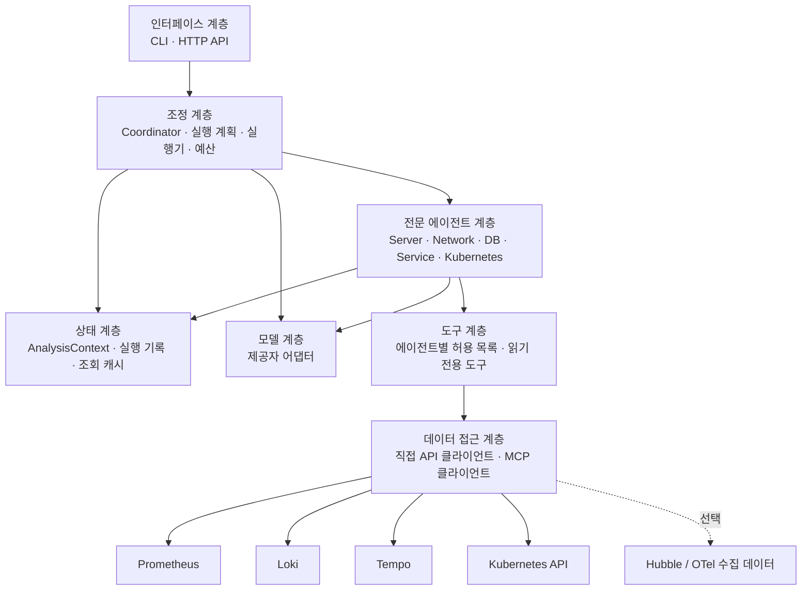
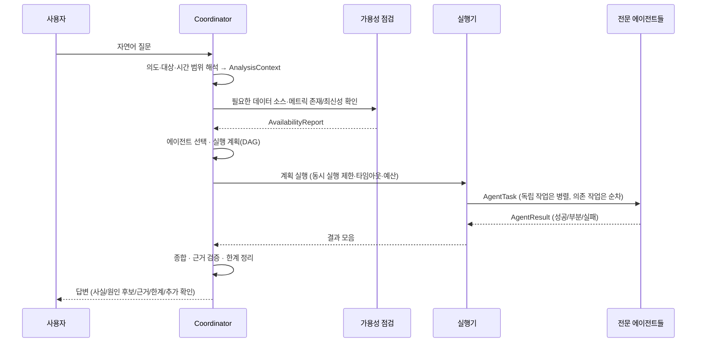

# 아키텍처 설계

> **상태: 일부 구현.** 공통 스키마(5절)·설정 모델(#5), 데이터 접근 계층 일부(7절, #7·#9), 카탈로그 조회 도구와 Server Agent·질문 해석·결과 종합(3·4·6절, #11), 모델 계층(10절, #15), 실행 계획·실행기(4·8절, #19), Kubernetes Agent(3절, #21), Service Agent와 Loki·Tempo 조회(3·7절, #23), DB Agent(3절, #25), Network Agent(3절, #27), 분야 간 교차 확인(3·5절, #29)이 구현되었습니다. 대표 질문 품질 평가 도구(#31)는 [evaluation.md](evaluation.md)를 봅니다.
> 구현이 진행되면 각 절에 구현 상태를 표시하고, 설계와 달라진 부분을 이 문서에 반영합니다.
> 기능 범위의 기준은 [README.md](../README.md)입니다.

## 1. 목적과 범위

사용자가 자연어로 서버, 네트워크, 데이터베이스, 서비스, Kubernetes의 상태나 이상 징후를 질문하면,
분야별 전문 에이전트가 실제 관측 데이터를 **읽기 전용으로** 조회·분석하고 근거와 한계를 포함한 통합 답변을 제공합니다.

| 구분 | 내용 |
| --- | --- |
| 초기 범위 | 상태 조회, 시간 구간 비교, 이상 징후 탐지, 영향 범위 분석, 근거 기반 원인 후보 제시 |
| 초기 범위 제외 | 상시 감시·알림, 자동 복구·설정 변경, 장애 주입, 학습 데이터 생성 |
| 사용하지 않는 것 | Pi Agent 프레임워크와 Pi 실행 환경 |

## 2. 계층 구성

에이전트 조정, 모델 호출, 데이터 조회, 상태 관리, 사용자 인터페이스를 분리합니다.
상위 계층은 하위 계층의 **인터페이스**에만 의존하며, 특정 모델 제공자나 데이터 소스 구현에 직접 의존하지 않습니다.



| 계층 | 책임 | 비고 |
| --- | --- | --- |
| 인터페이스 | 질문 입력, 답변 출력, 실행 옵션 전달 | 초기 CLI, 이후 HTTP API 제안 |
| 조정 | 의도·대상·시간 해석, 가용성 확인, 에이전트 선택, 실행 계획(DAG), 결과 종합 | Coordinator |
| 전문 에이전트 | 분야별 지침·도구로 조회하고 분석 결과를 공통 형식으로 반환 | 5개 에이전트 |
| 상태 | 요청 단위 컨텍스트, 조회 결과·근거 저장, 중복 조회 캐시 | 초기에는 요청 범위 메모리 |
| 모델 | 제공자별 API 차이를 숨기는 어댑터, 구조화 출력, 호출 예산 계측 | 제공자 미확정 |
| 도구 | 에이전트가 호출 가능한 읽기 전용 조회 함수, 파라미터 검증, 결과 크기 제한 | 쓰기 도구 없음 |
| 데이터 접근 | 데이터 소스 연결, 인증, 타임아웃, 재시도, 응답 정규화 | API 또는 MCP 구현 교체 가능 |

## 3. 에이전트 역할

각 에이전트는 **별도의 역할 지침, 허용 도구 목록, 분야별 결정적(deterministic) 분석 코드, 출력 검증**을 갖습니다.
하나의 모델 호출에서 역할 이름만 바꿔 답하는 방식은 사용하지 않습니다.

분석은 두 단계로 나눕니다.

1. **결정적 분석(Python 코드):** 조회, 집계, 기준 구간 비교, 임계값 판정, 상위 N 추출. 숫자 계산은 모델에 맡기지 않습니다.
2. **해석(모델):** 결정적 분석 결과와 근거를 입력으로 받아 의미, 원인 후보, 추가 확인 사항을 정리합니다. 모델이 언급한 수치는 근거 ID로 추적 가능해야 합니다.

아래 표의 "초기 데이터"는 개발 환경(OTel Demo, k3d) 탐색 결과(2026-09-29)이며, 상세 지표와 검증 상태는 [environment.md](environment.md) 3절, 조회식은 `config/catalog/otel-demo.yaml`을 기준으로 합니다.

| 에이전트 | 주요 분석 | 초기 데이터 (개발 환경) | 허용 도구 예시 |
| --- | --- | --- | --- |
| Coordinator | 의도·대상·시간 해석, 에이전트 선택, 작업 순서, 결과 종합, 충돌·누락 표시 | 각 에이전트 결과, 가용성 점검 결과 | 가용성 점검, 대상 해석(라벨 값 조회) |
| Server | **초기 대상은 k3d 노드·Pod·컨테이너 자원**: CPU·메모리 사용량과 할당 가능량·limit 대비 비율, 파일시스템, 네트워크 I/O, CPU 스로틀링 | Prometheus `k8s_node_*`, `k8s_pod_*`, `container_*` (kubeletstats, cAdvisor) | `prom_query`, `prom_query_range`, `prom_series` |
| Network | 패킷 드롭과 사유, 판정별 흐름, TCP 플래그, DNS 질의(응답 코드 없음), 인터페이스·Pod 네트워크 오류, Hubble 이벤트 유실 | Prometheus `hubble_*`, `k8s_node_network_*`, `k8s_pod_network_*`, `container_network_*` | `prom_*` (Hubble Relay 직접 조회는 미확인) |
| DB | PostgreSQL 연결 수 대비 최대치, 데드락, 롤백·캐시 적중률, DB 크기, 앱 커넥션 풀 사용률·대기, DB 작업 지연 분위수, Valkey 연결·메모리·퇴출·적중률 | Prometheus `postgresql_*`, `db_client_*`, `db_sql_*`, `redis_*`(Valkey), spanmetrics의 DB span; Loki 앱 로그; Tempo DB span(`db.system` 등 확인됨) | `prom_*`, `loki_query_range`, `tempo_search` |
| Service | 요청량, 오류율, 응답 시간(분위수), 서비스 간 호출·실패·지연, 로그 오류 패턴, 느린·실패 트레이스 | Prometheus `traces_spanmetrics_*`, `traces_service_graph_*`(Tempo metrics-generator), 서비스별 `http_*`·`rpc_*`; Loki; Tempo | `prom_*`, `loki_*`, `tempo_search`, `tempo_trace` |
| Kubernetes | 노드 조건·압박, Pod phase·컨테이너 준비·재시작·OOM, 워크로드 복제 상태(Deployment·StatefulSet·DaemonSet·Job·HPA), 요청·제한, Pending 사유·이벤트 | Prometheus `k8s_*`(k8s_cluster 수집), `container_oom_events_total`; 이벤트(수집 위치 미확인); Kubernetes API는 읽기 계정 준비 후 | `prom_*`, `loki_*`, (이후) `k8s_list`, `k8s_get`, `k8s_events` |

**Server Agent 구현 (#11, 모델 해석 #15):** `agents/server.py` — 판정은 코드, 원인 후보·추가 확인 제안은 모델(10.1절, `data_policy`가 none이 아니고 경고·심각이 있을 때)
- 상태 조회: 노드 CPU·메모리·파일시스템 사용률, 컨테이너 CPU·메모리 limit 대비 사용률, CPU 스로틀링을 임계값(`analysis.utilization_warning/critical`, `throttling_warning`)으로 판정하고 노드 CPU·메모리 현재 값을 함께 제시
- 비교·증가: 노드·Pod CPU·메모리의 분석 구간 평균을 같은 길이 직전 구간 평균과 비교(`increase_ratio`와 최소 증가량을 모두 넘을 때 증가로 판정)
- 빈 결과는 한계로, 최신성을 확인하지 못했거나 오래된 데이터로는 "기준 미만"이라고 판정하지 않음. 요청 대상으로 필터링할 수 없는 항목은 조회하지 않고 한계로 표시
- 카탈로그 조회 도구(`tools/catalog_query.py`)가 agent=server 항목만 실행하도록 강제

**Kubernetes Agent 구현 (#21):** `agents/kubernetes.py`, 지침 `agents/prompts.py`(`KUBERNETES_SYSTEM_PROMPT`) — Kubernetes API 연동 전이므로 Prometheus의 k8s_cluster·cAdvisor 지표로 판정
- 현재 상태: 노드 NotReady(심각)·압박, Pod phase가 Running·Succeeded가 아닌 Pod(Failed 심각, Pending·Unknown 경고), not ready 컨테이너(완료된 Pod 제외), Deployment·StatefulSet·DaemonSet 복제 부족, 실패 Pod가 있는 Job, 최대 복제에 도달한 HPA
- 분석 구간: 컨테이너 재시작 증가(경고), OOM 이벤트(심각). 분석 구간 전체의 증가량(`window` 조회)으로 판정하며, 상태 질문은 기본 구간(`execution.default_time_range`)을 씀
- **조건 조회의 빈 결과:** 문제 대상만 결과로 나오는 조회이므로, 조회 성공 + 기준 지표가 최신 + (대상 필터가 있으면) 그 대상의 기준 지표 시계열 존재(`CatalogQueryTool.coverage`)를 모두 확인한 경우에만 "해당 대상 없음"으로 판정합니다. 하나라도 확인하지 못하면 한계로 표시합니다.
- 재시작과 OOM 이벤트가 같은 컨테이너에서 함께 확인되어도 종료 사유를 조회하지 않았으므로 인과를 단정하지 않고 추가 확인으로 제안합니다. Pending 사유·종료 사유·이벤트는 Kubernetes API 연동(8b) 후 확인합니다.
- Pod phase 값(1=Pending … 5=Unknown)은 OTel k8s_cluster 수신기 정의를 따른 가정이며 답변 한계에 표시합니다.
- Server Agent가 제안한 "limit 근접 컨테이너의 OOM·재시작 확인"은 같은 요청에서 Kubernetes Agent가 성공하면 종합 단계에서 뺍니다.
- 질문 해석: "Pod·컨테이너·노드"만으로는 서버 자원 분야로 보지 않고, Kubernetes 키워드가 있으면 Kubernetes만 실행합니다(자원 키워드가 함께 있으면 Server ∥ Kubernetes).

**Service Agent 구현 (#23):** `agents/service.py`, 지침 `SERVICE_SYSTEM_PROMPT`, 도구 `tools/catalog_query.py`(spanmetrics·service graph), `tools/log_query.py`(Loki, 카탈로그 `log.*`), `tools/trace_search.py`(Tempo TraceQL)
- 요청량·오류율·p95 지연은 SERVER span 기준(없으면 전체 span으로 대체하고 한계 표시). 오류율은 `analysis.error_ratio_warning/critical`, 지연은 `latency_p95_warning_seconds`로 판정하고, 요청이 `min_request_rate`보다 적은 서비스는 오류율을 판정하지 않음
- 오류율 결과에 없는 서비스는 요청 결과가 있고 조회가 성공·최신일 때만 "오류 span 없음"으로 봄. 요청 데이터가 없거나 오래되면 오류율·지연을 판정하지 않음. 대상 필터가 있는데 요청 결과가 없으면 대상 시계열 존재(`coverage`)를 확인해 사유를 구분
- 서비스 간 호출(service graph): 호출 경로별 실패율 = 실패/전체, 서버 측 지연 p95. DB 호출 span 지연 p95(`db_system_name`이 있는 span)
- 비교·이상 질문: 오류율(구간 평균 차이 ≥ `min_error_ratio_increase`)과 지연(`increase_ratio`와 `min_latency_increase_seconds` 모두) 증가를 직전 구간과 비교
- 오류 서비스 상세(오류율 기준 초과·증가, 또는 기준을 넘는 호출 실패를 응답한 쪽(server) 서비스; 상위 `detail_services`개). 응답한 쪽이 계측되지 않은 대상(DB·외부 시스템 등, spanmetrics에 없음)이면 호출한 쪽(client) 서비스를 대상으로 하고 CLIENT span 오류율에서 최고 시점을 찾음
  1. 오류율 시계열(`CatalogQueryTool.series_peaks`)에서 최고 시점을 찾고 전후 `peak_window_seconds` 구간을 확인 구간으로 삼음(오류율이 0보다 큰 시점이 없으면 구간 전체)
  2. 그 구간의 전체 로그 수(존재 확인)·오류 키워드 로그 수·샘플(Loki), 오류 트레이스(Tempo, 연결 확인용 최대 20건 검색·표시 `trace_sample_limit`건)
  3. 오류 로그 샘플과 오류 트레이스에 같은 trace_id(양쪽 모두 32자리 16진수로 맞춘 값)가 있으면 "연결됨"으로 기록(동시 발생 사실만, 인과 단정 없음)
  4. 로그 수가 0이면 오류 로그를 판단하지 않고, 오류율이 있는데 트레이스 검색 결과가 없으면 한계로 표시
- 지연 서비스 상세(응답 지연 p95 기준 초과 또는 직전 구간 대비 증가; 상위 `detail_services`개): 지연 p95 시계열(SERVER span 우선)에서 최고 시점을 찾고, 전후 `peak_window_seconds` 구간에서 그 시점 p95 이상 걸린 SERVER span의 트레이스를 검색(TraceQL `kind = server && duration > Nms`). 오래 열린 스트리밍 호출(CLIENT span)이 느린 요청으로 섞이지 않게 SERVER span만 찾음. 결과가 없으면 p95가 히스토그램 근사값임을 한계에 표시. 로그는 보지 않음
- SERVER 외 span 종류(CLIENT·INTERNAL 등)의 오류율은 판정 기준을 적용하지 않고 사실로 따로 표시(SERVER span 기준 "오류 없음"이 전체 오류 없음으로 읽히지 않게 함)
- 질문이 로그·트레이스를 물으면 분석 구간의 서비스별 오류 키워드 로그 수와 오류 트레이스(루트 서비스별) 개요를 제공하고, 상세 자리가 남으면 오류 로그가 많은 서비스 → SERVER 외 span 오류 서비스(현재 5분) → 분석 구간 오류 트레이스의 루트 서비스 순으로 골라 로그 샘플·오류 트레이스·trace_id 연결을 확인. 현재 5분 오류율은 짧은 구간이라, 구간 중에만 오류가 있던 서비스(예: 10분마다 끊기는 스트리밍 호출)는 오류 트레이스로 보완함. 서비스로 보는 이름은 span 종류와 관계없이 spanmetrics에 나타난 서비스(CLIENT·CONSUMER 전용 서비스 포함)와 오류 트레이스에 나타난 서비스이며, 로그에서만 나온 이름(클러스터 객체 로그 등)은 서비스가 아니므로 상세 확인에서 제외. 어떤 기준으로 어느 서비스를 골랐는지, 고르지 못했으면 그 사실을 한계에 적음. Tempo가 루트 span을 아직 받지 못한 트레이스에 주는 표시(`<root span not yet received>`)는 "(루트 span 미수신)"으로 집계하고 상세 대상에서 제외
- 지연 p95가 히스토그램의 최대 유한 버킷 경계와 같으면(`CatalogQueryTool.max_bucket_bound`) "N초 이상(히스토그램 최대 구간)"으로 표시하고 한계에 적음. 스트리밍처럼 오래 열린 호출은 지연이 아니라 연결 유지 시간일 수 있음
- 로그 본문은 외부 데이터: 도구 계층에서 제어문자 제거·공백 정리·마스킹·길이 제한(200자), 라벨은 서비스·Pod·레벨 관련만 남김. 답변에는 근거별 최대 3건을 "(로그 원문)"으로 표시하고, 모델에는 `data_policy: full`일 때만 근거별 최대 5건을 `<observed_data>` 안에 전달
- 상세 단계는 에이전트 남은 시간이 조회 1회 제한 시간 + 7초보다 적으면 생략하고 한계에 표시(앞서 판정한 결과가 제한 시간 초과로 버려지지 않게 함)
- 직전 구간 대비 오류율 비교에서 비교할 서비스 결과가 없으면 "증가한 대상 없음"이라고 하지 않고 한계에 적음(#29)
- 네트워크·DB 내부 지표는 조회하지 않으므로 "네트워크 문제/DB 문제"를 단정하지 않음. 질문이 함께 물으면 Service 다음에 Network·DB Agent가 병렬로 확인

**Network Agent 구현 (#27):** `agents/network.py`, 지침 `NETWORK_SYSTEM_PROMPT`, 도구 `tools/catalog_query.py`(카탈로그 `network.*`)
- 구간 내 발생 수(분석 구간 전체 `increase()`, 0.5 이상이면 발생): Hubble 패킷 드롭(사유·출발·도착 워크로드별), 노드 인터페이스 오류, Pod 네트워크 오류, 컨테이너 패킷 드롭. 0이면 최신 데이터일 때만 "발생 없음"
- 흐름 판정 비율: 네임스페이스 쌍별 DROPPED·ERROR 판정 흐름 비율(`flow_drop_ratio_warning`, 흐름이 `min_request_rate`보다 적은 쌍 제외, 확인한 판정 값을 함께 표시)
- 현재 값(판정 없음): TCP RST 패킷(RST가 없으면 확인한 플래그 값을 표시), DNS 질의량. DNS 응답 코드·네트워크 지연(RTT)은 수집되지 않아 판단하지 않음
- Hubble 이벤트 유실이 있으면 정보로 표시하고 Hubble 기반 결과가 불완전할 수 있음을 한계에 적음
- Hubble 지표의 `k8s_*` 라벨은 수집 주체(cilium)이므로 대상은 `source_*`·`destination_*`로 표시. 빈 값은 "외부·미확인". Prometheus는 빈 값 라벨을 결과에서 빼므로, Hubble 항목은 출발·도착 라벨이 아예 없어도 흐름("외부·미확인 → 외부·미확인")으로 표시
- 드롭 사유에는 정책 거부처럼 의도된 차단도 있어 드롭이 곧 장애라고 단정하지 않음(한계·지침에 명시)
- `benign_drop_reasons`(기본 `UNSUPPORTED_L3_PROTOCOL`: IPv4·IPv6가 아닌 L3 패킷, 예: ARP)에 있는 사유는 발생 수를 그대로 보이되 경고가 아닌 정보로 표시하고, 그 사실을 한계에 적음. 표시 순서는 경고 대상 먼저
- DNS 질의량 합계가 0이면 사실로 표시하지 않고, Hubble DNS 지표는 DNS 가시성(L7 DNS 프록시 정책)이 적용된 흐름만 집계하므로 실제 질의가 없다는 뜻이 아닐 수 있음을 한계에 적음
- 네임스페이스·워크로드 필터는 Hubble 항목에서 도착 기준이므로, 필터가 있으면 한계에 적고 판정 문장에 "(도착 기준)"을 붙임. Hubble 이벤트 유실은 관측 품질 점검이라 대상 필터 없이 전체를 봄
- 흐름이 적어 비율을 판정하지 않은 네임스페이스 쌍은 개수(드롭·오류 판정이 있는 쌍 수 포함)를 한계에 적음. 결과에 TCP 플래그 값이 없으면 RST 여부를 판단하지 않음
- 선행 Service 결과에 이상 서비스가 있으면 이름이 같은 Hubble 워크로드를 집중 확인(#29, 심각한 대상부터 `top_n`개): 나가는·들어오는 흐름 판정 비율(Service가 찾은 그 서비스의 이상 최고 시점까지 5분, 최고 시점을 모르거나 구간 끝 1분 안이면 현재 5분. `network.workload_egress_by_verdict`·`network.workload_ingress_by_verdict`)과 구간 내 드롭(비장애성 사유 제외)
  - 워크로드 쌍 집계는 시계열이 매우 많아(tcp_flags 약 1.4만) 방향별로 한쪽 워크로드(네임스페이스 포함)만 집계. 같은 이름이 여러 네임스페이스에 있으면 합쳐 계산하고 한계에 적음
  - 경고는 흐름 판정 비율로만 정함(구간 내 드롭은 드롭 판정에서 이미 경고로 셈)
  - 최고 시점 조회는 `CatalogQueryTool.query(at=…, tag=서비스)`로 평가 시각을 지정하고, 근거 ID는 `<key>@current:<서비스>`, 근거 구간은 평가 시각까지 5분으로 기록. 최고 시점은 Service 최고 시점 사실의 `Finding.observed_at`에서 읽음
  - 같은 이름의 워크로드가 없으면 "연결하지 못함"으로 한계에 적음. 방향별로 결과가 없거나 라벨이 없거나 조회에 실패하면 "흐름 없음"이라고 하지 않고 그 사유를 표시. 최신성을 확인하지 못하면 판단하지 않음
- Network·DB는 선행 결과 없이도 분석할 수 있으므로(`plan.OPTIONAL_UPSTREAM`), Service가 실패해도 건너뛰지 않고 실행
- 질문 해석에 등록되지 않은 에이전트가 있으면 실행 계획의 `unavailable`을 "확인하지 못한 영역"에 반영(`runner`)

**DB Agent 구현 (#25):** `agents/db.py`, 지침 `DB_SYSTEM_PROMPT`, 도구 `tools/catalog_query.py`(카탈로그 `db.*`·`cache.*`)
- PostgreSQL 직접 접속 없이 수집 지표로 판정. 높을수록 문제: PostgreSQL 연결 사용률·앱 커넥션 풀 사용률(`utilization_warning/critical`), 롤백 비율(`rollback_ratio_warning`), DB 작업 지연 p95·DB 호출 span 지연 p95(`latency_p95_warning_seconds`, Service Agent의 DB 호출 판정과 같은 기준). 낮을수록 문제: 버퍼 캐시 적중률(`cache_hit_ratio_warning`)
- 구간 내 발생 수(분석 구간 전체 `increase()`, 0.5 이상이면 발생): 데드락, 커넥션 풀 대기, Valkey 키 퇴출·연결 거부. 0이면 최신 데이터일 때만 "발생 없음"
- 현재 값(판정 없음): PostgreSQL DB별 연결 수·DB 크기, Valkey 클라이언트 수·메모리·키 적중률
- 비교·이상 질문: DB 작업·DB 호출 span 지연 p95의 직전 구간 평균 대비 증가(`increase_ratio`와 `min_latency_increase_seconds` 모두)
- 커넥션 풀 사용률은 상태 라벨 값이 idle인 연결을 뺀 **사용 중 연결** 기준(상태 값 이름은 가정, 한계에 표시). 풀 이름(연결 문자열일 수 있음)은 대상 이름에 쓰지 않음
- 결과가 없으면 정상으로 보지 않고 사유(지표 없음, 최근 5분 트랜잭션 없음, 최대 연결 0 등)와 함께 한계에 적음. 대상 필터가 있으면 대상 시계열 존재(`coverage`)로 오타 등을 구분
- 선행 Service Agent 결과에 DB 호출 span 지연(현재)이 있으면 다시 조회하지 않고 한계에 적음(선행 결과는 중복 조회를 피하는 데만 사용)
- 지연 p95가 히스토그램의 최대 유한 버킷 경계와 같으면 "N초 이상(히스토그램 최대 구간)"으로 표시(Service와 같은 방식)
- 지연 p95가 첫 구간(0 ~ 첫 경계) 안의 보간값이고 첫 경계가 기준 이상이면 기준과 비교할 수 없으므로 판정하지 않고 한계에 적으며, 버킷 경계 설정을 추가 확인으로 제안(직전 구간 비교에서도 두 값이 모두 첫 구간 안이면 비교하지 않음). 경계는 서비스 라벨별로 조회(`CatalogQueryTool.bucket_bounds_by`, 같은 지표라도 서비스마다 경계가 다를 수 있음)
- 커넥션 풀 사용률 결과가 비면 분모(최대 열린 연결 수)를 따로 조회해 0(제한 없음)인지 구분(`db.pool_max_open_product_catalog`)
- 질문 해석(규칙 기반)
  - 쿼리·커넥션 등 DB 내부 단어가 있고 서비스 분야가 "느려·지연·slow" 같은 공통 단어로만 판별되면 DB만 실행("쿼리가 느려진 징후" → DB, "checkout 느린 이유가 DB야?" → Service와 DB)
  - 서버 자원 키워드가 있고 DB 분야가 "캐시"로만 판별되면 DB를 붙이지 않음("노드 메모리 캐시" → Server)
  - 영문 키워드는 앞에 다른 영문자·숫자가 붙지 않은 경우만 인정("block"의 lock, "catalog"의 log 제외)
  - "느려진"은 직전 구간 대비 비교(anomaly)로 해석. 모델 해석 지침에도 같은 기준을 적음

**분야 간 교차 확인 (#29):** `answer/cross.py`(Coordinator 종합 단계, 모델 없이), 공통 추출 `agents/upstream.py`
- Service Agent 결과와 다른 분야(Network·DB·Kubernetes·Server) 결과가 함께 있을 때만 실행. 단일 분야 질문에는 붙이지 않음
- 이상 서비스: Service Agent의 경고·심각 사실의 대상 서비스(호출 경로는 호출받는 쪽, DB 호출은 호출한 서비스)와 이상 종류(오류율·응답 지연·호출받는 지연 등, 근거 항목으로 판별)
- 연결 기준
  - 같은 대상: 다른 분야 이상 사실의 대상 라벨(서비스·워크로드·컨테이너 이름)이 이상 서비스 이름과 같음 → 원인 후보 신뢰도 medium
  - 간접 연결: 이상이 DB·캐시 전체 지표(`db.pg_*` → postgresql, `cache.valkey_*` → redis·valkey)이고 이상 서비스가 그 DB 종류를 호출함(Service Agent의 DB 호출 span `db_system_name`) → 신뢰도 low
- 연결은 같은 분석 구간 안의 동시 발생일 뿐이므로 `basis=correlation`인 원인 후보(추정)로만 표시하고 인과를 단정하지 않음(한계에도 적음)
- 분야별 줄: 연결된 이상 수, 연결되지 않은 이상(최대 2건 표시), 기준을 넘는 이상 없음, 판단할 결과 없음·실패로 확인하지 못함을 구분
- 서비스별 줄: 분야마다 "연결된 이상", "이 서비스 관련 결과에서 기준을 넘는 이상 없음"(그 서비스를 대상으로 하거나 그 서비스가 호출하는 DB를 다룬 사실이 있을 때만), "DB 호출 span에 이 서비스의 DB 호출이 없음", "이 서비스와 연결할 수 있는 결과가 없어 판단하지 못함"(Pod·노드 단위 결과 등)으로 나눔. 연결된 분야가 없으면 "원인 분야를 가리지 못함"을 붙이고, 부분 성공 분야는 "(일부 조회 미완료)"로 표시
- "이상 없음" 판단에 쓰는 사실은 기준 판정(`threshold`·`baseline`)만 인정(판정 기준 미적용 사실 제외). Network 집중 확인 사실도 비율이나 드롭을 실제로 판정했을 때만 서비스 대상을 붙임
- 요약의 분야별 연결 수는 서비스 단위로 연결 여부를 판단할 수 있었던 분야만 세고, 나머지는 "연결 여부를 판단하지 못함"으로 따로 적음
- Service가 실패했거나 오류율·응답 지연 판정 결과가 없으면 "이상 대상 없음"이 아니라 판단하지 못했다고 표시. Service가 부분 성공이면 빠진 대상이 있을 수 있다고 적음
- DB 호출 종류는 Service·DB Agent의 DB 호출 span 결과(결과가 있고 최신인 것만)에서 읽고, 없으면 간접 연결을 확인하지 않았다고 한계에 적음(빈 결과·오래된 결과로 "DB 호출 없음"이라고 하지 않음)
- 원인 후보의 심각도는 서비스 이상과 연결된 이상 중 높은 쪽
- 종합(`synthesis`)은 실행됐지만 판단 결과(사실)가 없는 분야를 "확인하지 못한 영역"에 적고, 다른 분야 결과가 있으면 요약 끝에도 밝힘(#31). 에이전트는 판단 결과가 없으면 "이상 징후가 없어 원인 후보 생략" 한계를 붙이지 않음(`agents/common.with_explanation`)
- 시간 기준은 분야마다 다름(Network 집중 확인은 서비스 이상 최고 시점, DB·Kubernetes·서버는 현재 값 또는 분석 구간 집계)이며 한계에 적음. "DB 호출 없음"도 서비스 단위 판단으로 요약의 분야별 연결 수에 포함
- 요약 끝에 서비스 이상 대상 수와 분야별로 연결된 대상 수를 붙임

범위 제한:

- `node_*`, `kube_*` 지표는 개발 환경에서 확인되지 않았으므로 가정하지 않습니다.
- `system_*` 지표는 Pod 단위 자동 계측 값으로 보이므로(탐색 결과) 물리 서버 전체 값으로 해석하지 않고 카탈로그에서 제외했습니다. 물리 서버 전체 성능 분석은 호스트 수준 수집 구성 후 확장합니다.
- DB는 PostgreSQL 직접 SQL 접속 없이 관측 데이터로 분석합니다. `pg_stat_statements`, 실행 계획, 잠금 대기·잠금 그래프는 수집되지 않습니다.
- Server와 Kubernetes의 경계: Server는 자원 **사용량**, Kubernetes는 리소스 **상태·이벤트·스케줄링·요청/제한**을 담당합니다.

실제 사용할 지표 이름과 라벨은 코드에 고정하지 않고, 실제 지표 탐색 결과로 만든 **조회 카탈로그**를 통해 결정합니다(7절).

## 4. 처리 흐름



### 4.1 질문 해석

- **의도 유형:** `status`(상태 조회), `compare`(구간 비교), `anomaly`(이상 탐지), `impact`(영향 범위), `root_cause`(원인 후보).
- **대상:** 호스트, 네임스페이스, 워크로드, 서비스, DB 인스턴스 등. 이름은 실제 라벨 값이나 Kubernetes 리소스 조회로 해석하고, 모호하면 후보를 제시합니다.
- **시간 범위:** 모든 범위는 절대 시각(UTC, 시작·끝)으로 정규화해 모든 에이전트가 공유합니다.
  - 기본값(제안): 명시가 없으면 최근 30분.
  - "직전 30분과 비교": 현재 구간 `[now-30m, now]`, 기준 구간 `[now-60m, now-30m]`.
- 해석 결과는 답변에 명시해 사용자가 범위를 확인할 수 있게 합니다.

> **현재 구현 (#11): 규칙 기반 해석** — `orchestration/rules.py`. 키워드·정규식으로 의도(비교·증가 키워드가 없으면 상태 조회), 시간("N분/시간/일", 없으면 `execution.default_time_range`, 최대 7일), 대상(하이픈·숫자가 있는 이름의 namespace/node/pod, CLI 옵션 우선), 분야를 판별합니다. 판별하지 못한 부분은 기본값을 쓰고 답변의 "가정"에 표시하며, 구현되지 않은 분야는 "확인하지 못한 영역"으로 답합니다. 분야를 특정하지 못하면 비교·증가 질문은 서버 자원·서비스·DB, 상태 질문은 서버 자원으로 봅니다(#31). 
> **모델 기반 해석 (#15):** 모델을 쓸 수 있으면 `orchestration/llm_interpret.py`가 질문을 구조화하고(질문 문장만 전송), 결과는 규칙 기반과 같은 `finalize()`로 검증·보정합니다. 모델 호출·검증이 실패하면 규칙 기반 해석으로 대체하고 답변의 "해석 방식"에 사유를 표시합니다.

### 4.2 에이전트 선택 예시

| 질문 | 선택 | 실행 방식 |
| --- | --- | --- |
| "현재 서버 상태가 어때?" | Server (초기에는 k3d 노드 기준으로 답하고 범위를 명시) | 단일 |
| "최근 30분 CPU나 메모리가 비정상 증가한 서버?" | Server (노드·Pod·컨테이너) | 단일 (기준 구간 비교) |
| "응답이 느려진 이유가 네트워크인지 DB인지" | Service → (Network ∥ DB) | Service로 대상·시간 확정 후 병렬 |
| "DB 커넥션 풀 부족이나 쿼리 지연 징후?" | DB | 단일 |
| "재시작하거나 Pending인 Pod 확인" | Kubernetes | 단일 |
| "오류 증가 시간대의 로그와 트레이스 연결" | Service (필요 시 → Kubernetes/DB) | 순차 |
| "직전 30분과 비교해 무엇이 달라졌나" | 가용한 분야 중 질문 대상 관련 에이전트. 분야를 특정하지 않으면 직전 구간 비교가 가능한 Server ∥ (Service → DB)이며, Kubernetes·Network는 확인하지 않음을 가정에 표시 (#31) | 병렬 (DB는 Service 이후) |

단순 조회 질문을 광범위한 장애 분석으로 확장하지 않습니다. 확장이 필요하다고 판단되면 답변의 "추가 확인 사항"으로 제안합니다.

### 4.3 데이터 가용성 점검

분석 전에 다음을 확인하고 결과를 `AvailabilityReport`로 보관합니다.

| 항목 | 확인 방법 (예) |
| --- | --- |
| 연결 가능 여부 | Prometheus `/-/ready`·`/api/v1/status/buildinfo`, Loki `/ready`, Tempo `/ready`, Kubernetes `/version` |
| 수집 대상 | Prometheus `/api/v1/targets`, `up` 시계열, Loki 라벨 값, Kubernetes 네임스페이스 |
| 실제 메트릭·라벨·필드 | Prometheus `/api/v1/series`, `/api/v1/labels`, Loki `/loki/api/v1/labels`, Tempo 태그 검색 |
| 최신성 | 최신 샘플 시각과 현재 시각의 차이(예: `time() - timestamp(metric)`) |
| 조회 가능 기간 | 요청 범위 시작 시점 데이터 존재 여부 확인 |

필요한 지표가 없으면 해당 분석을 "확인 불가"로 표시하고 필요한 수집 설정(예: exporter, 애플리케이션 계측)을 제안합니다. **데이터가 없다는 사실을 정상으로 해석하지 않습니다.**

## 5. 공통 입출력 형식

> **구현됨 (#5):** `src/infra_agent/schemas/models.py`가 기준입니다. 아래는 요약이며, 필드가 다르면 코드가 우선합니다.
> 모든 모델은 불변(frozen)이고 정의되지 않은 필드를 거부합니다. 모든 시각은 UTC timezone-aware datetime입니다.

```text
TimeRange                  # start < end, UTC. last(duration, now), previous()(같은 길이의 직전 구간)
TargetRef                  # kind: host|node|namespace|workload|pod|container|service|database, name, labels

AnalysisContext            # 요청 단위로 Coordinator가 생성, 모든 에이전트가 읽기 전용으로 공유
  request_id, question
  intent: status | compare | anomaly | impact | root_cause
  time_range: TimeRange, step_seconds
  baseline_range: TimeRange | null      # intent=compare이면 필수
  targets: [TargetRef]
  budget: {max_llm_calls, max_tool_calls, deadline}

AgentTask
  task_id, agent: server|network|db|service|kubernetes|coordinator, objective
  depends_on: [task_id]                 # 자기 자신 의존 금지
  inputs: {…}

ToolResult                 # 모든 조회 결과. 근거(evidence)의 원천
  evidence_id, source: prometheus|loki|tempo|kubernetes|hubble
  query                    # 실행한 조회식(비밀값 제외)
  time_range, status: ok|empty|error|timeout|truncated
  data, freshness_seconds, fetched_at, error
  synthetic: bool          # 테스트용 가상 데이터 여부

Finding
  kind: fact | hypothesis
  statement, severity: info|warning|critical, targets
  evidence_ids: [str]      # 1개 이상 필수
  basis: threshold | baseline | state | correlation
  confidence: low|medium|high   # hypothesis에 필수, fact에는 금지
  observed_at: datetime | null  # 시점이 있는 사실(오류율·지연 최고 시점 등)의 관측 시각 (#29)
  # 규칙: basis=correlation은 fact가 될 수 없음

AgentResult
  task_id, agent, status: success|partial|failed|skipped
  findings, evidence: [ToolResult]   # findings의 evidence_ids는 evidence에 존재해야 함
  limitations, next_checks, errors: [{code, message}], usage: {llm_calls, tool_calls, elapsed_ms}
  rejected_hypotheses: [{statement, evidence_ids, reasons}]   # 검증 실패로 제외한 모델 원인 후보(진단용, 답변 본문 제외)
  # 규칙: failed에는 findings 금지, failed/partial에는 errors 또는 limitations 필수

FinalAnswer
  request_id, summary, time_range
  facts: [Finding(fact)], hypotheses: [Finding(hypothesis)]
  evidence: [{source, query, time_range, key_values}]
  limitations, unverified_areas, next_checks
  cross_checks: [str]                   # 분야 간 교차 확인 줄 (#29)
  correlations: [Finding(hypothesis)]   # 분야 간 동시 발생 원인 후보, basis=correlation만 허용
```

"현재 상태·이상 징후·영향 범위"는 별도 필드가 아니라 `summary`와 Finding(`severity`, `targets`)으로 표현합니다. 분야 간 연결은 `cross_checks`와 `correlations`로 표현하며, 모델 원인 후보(`hypotheses`)와 구분해 답변에 표시합니다.

## 6. 분석·판단 원칙

- 이상 여부는 **관측값 + 판단 기준**(설정 임계값, 기준 구간 대비 변화, 리소스 상태값)으로만 판정하고 `basis`에 기록합니다.
- 시간상 동시 발생은 `basis: correlation`의 `hypothesis`로만 표현하며 인과관계로 확정하지 않습니다.
- 모든 수치와 주장은 `evidence_ids`로 실제 조회 결과를 가리켜야 합니다. 종합 단계에서 근거 없는 Finding은 제외하거나 추정으로 강등합니다.
- 조회하지 않은 값, 존재하지 않는 메트릭·로그·트레이스를 생성하지 않습니다.
- 일부 에이전트가 실패하면 성공한 분석과 확인하지 못한 영역을 구분해 답변합니다.

## 7. 데이터 접근 계층

> **일부 구현 (#7):** `src/infra_agent/datasources/` — 공통 HTTP 기반(`http.py`: GET 전용, 허용 경로 목록, 일시 오류만 재시도, 토큰 마스킹), `prometheus.py`(ready·buildinfo·runtimeinfo·지표/라벨/메타데이터·query·query_range·selector 이스케이프), `loki.py`·`tempo.py`(탐색용 최소 기능), `probe.py`(연결 점검). Kubernetes·Hubble·MCP 경로와 도구 계층은 아직 없습니다.

```text
DataSource (인터페이스)
  ├─ PrometheusSource   : query, query_range, series, labels, targets
  ├─ LokiSource         : query_range, labels, label_values
  ├─ TempoSource        : search, get_trace, tags
  ├─ KubernetesSource   : list, get, events (get/list/watch 권한만)
  └─ HubbleSource       : flows (선택)
구현 방식: DirectHttpClient | McpClient  — 설정으로 선택
```

- 에이전트는 데이터 소스 구현이 아니라 **도구 인터페이스**만 사용합니다.
- **조회 카탈로그(설정 파일):** 분석 항목(예: `node.cpu_usage`)별 PromQL/LogQL/TraceQL, 필요한 지표, 라벨 매핑, 검증 상태를 환경별 파일로 정의합니다. 가용성 점검에서 필요한 지표가 실제로 존재하는 항목만 실행합니다. 카탈로그는 탐색 명령의 결과를 사람이 검토해 구성합니다. 형식과 탐색 절차는 [environment.md](environment.md) 4절을 따릅니다.
- 결과 크기 제한(시계열 수, 로그 줄 수, 트레이스 수)과 요약을 적용해 모델 입력량을 통제합니다.
- 연결 주소, 인증정보, 모델 설정은 환경 변수 또는 마운트된 설정/Secret에서 읽습니다.

## 8. 실행 제어

> **현재 구현 (#11, #19):** `orchestration/plan.py`(실행 계획), `orchestration/executor.py`(실행기), `agents/base.py`(에이전트 공통 인터페이스).
> - 계획: 질문 분야 → 에이전트 작업 템플릿. 구현된 에이전트(`runner.AGENT_BUILDERS`)만 넣고 나머지는 "확인하지 못한 영역". 의존 규칙은 Network·DB → Service 선행(두 에이전트가 모두 계획에 있을 때만). Network·DB는 선택적 선행이라 Service가 실패해도 실행합니다(#27). 작업 ID 중복·없는 선행 작업·순환을 검증합니다.
> - 실행: 선행 작업이 끝난 작업부터 시작하고, 동시에 실행되는 에이전트 수를 `execution.max_concurrency`로 제한합니다. 선행 결과는 `upstream`으로 전달합니다.
> - 제한 시간: 에이전트별 `agent_timeout_seconds`와 요청 마감 시각(`request_timeout_seconds`) 중 먼저 오는 것, 도구 호출별 `tool_timeout_seconds`.
> - 에이전트 안의 모델 해석은 그 에이전트의 남은 시간(`agents.base.remaining_seconds()`) 안에서만 실행합니다. 남은 시간이 부족하면 생략하고, 시간 안에 응답이 없으면 해석만 버리고 코드 판정 결과는 유지합니다(에이전트 제한 시간 초과로 결과 전체가 버려지는 것을 방지).
> - 부분 실패: 예외·타임아웃·다른 작업의 결과 반환은 `failed`, 선행 작업이 `failed`/`skipped`이거나 마감이 지난 작업은 `skipped`. `partial` 선행 결과로는 계속 실행합니다. 오류 메시지는 마스킹하고 답변의 "확인하지 못한 영역"과 실행 정보에 사유를 표시합니다.
> - 예산: 조회 호출 상한(`ToolBudget`)과 모델 호출 상한(`BudgetedLLM`)은 요청 단위 객체를 모든 에이전트가 공유합니다. 에이전트별 실행 시간을 `usage.elapsed_ms`에 기록합니다.
> - 재시도: 데이터 소스 일시 오류만 클라이언트가 재시도합니다. 에이전트 단위 재시도는 하지 않습니다(같은 조회·모델 호출을 반복해 예산을 두 번 쓰고, 타임아웃 대부분은 재시도로 해결되지 않음).
> - 중복 조회 캐시는 같은 지표를 조회하는 두 번째 에이전트가 생기는 8단계 이후 구현합니다.

| 항목 | 설계 |
| --- | --- |
| 동시 실행 | 전역 세마포어로 에이전트·도구 동시 실행 수 제한 |
| 제한 시간 | 요청 전체 deadline, 에이전트별 타임아웃, 도구 호출별 타임아웃 |
| 재시도 | 일시 오류(연결 오류, 5xx, 429)만 제한 횟수·지수 백오프로 재시도. 쿼리 오류(4xx)는 재시도하지 않음 |
| 모델 호출 예산 | 요청당 모델 호출 수·토큰 상한, 에이전트별 도구 호출 루프 상한 |
| 중복 조회 방지 | `(source, query, time_range)` 키의 요청 범위 캐시 |
| 부분 실패 | 실패·타임아웃 에이전트는 `failed`로 기록하고 나머지 결과로 종합 |

## 9. 보안

- **읽기 전용:** 도구 계층에 쓰기 작업을 제공하지 않습니다. Kubernetes는 `get/list/watch`만 허용하는 전용 ServiceAccount/RBAC를 사용하고 `secrets` 리소스 조회 권한은 부여하지 않습니다.
- **Kubernetes 계정:** 관리자 kubeconfig를 프로그램에 사용하지 않습니다. 전용 읽기 계정의 kubeconfig 경로만 설정으로 받습니다.
- **모델 SDK 제한:** Claude Agent SDK의 내장 파일·셸 도구와 로컬 설정 로딩을 비활성화하고, 에이전트별 읽기 전용 도구만 허용합니다(10.1절).
- **모델 입력 범위:** 외부 모델로 보내는 데이터는 `llm.data_policy`로 제한합니다(10.2절).
- **비밀값 보호:** 인증정보를 코드·Git·모델 입력·답변·로그에 남기지 않습니다. 로그 출력 전에 토큰·비밀번호 패턴을 마스킹합니다.
- **외부 데이터 격리:** 조회된 로그, 이벤트 메시지, 트레이스 속성은 **데이터**로만 취급합니다. 모델 입력에서 구분자로 격리하고, 그 안의 문장을 실행 지시로 따르지 않도록 지침에 명시합니다. 도구 허용 목록은 코드에서 강제되므로 데이터 내용으로 권한이 확장되지 않습니다.

## 10. 기술 선택

### 10.1 모델 연동: Claude Agent SDK (1차 어댑터)

**결정:** 첫 번째 모델 어댑터는 Claude Agent SDK(Python 패키지 `claude-agent-sdk`, 선택 의존성 `.[llm]`)입니다.
**미확정 유지:** 최종 모델 제공자와 사용할 모델은 결정되지 않았습니다. 코드는 `LLMClient` 인터페이스(`llm/base.py`)에만 의존하며 다른 제공자로 교체할 수 있습니다.

> **구현됨 (#15):** `llm/` — `LLMClient`, 요청당 호출 상한(`BudgetedLLM`), 가짜 모델(테스트), `ClaudeAgentSDKClient`, 데이터 정책(`llm/policy.py`)

모델의 역할(현재 구현):

| 용도 | 담당 | 모델 입력 | 출력 검증 |
| --- | --- | --- | --- |
| 질문 해석 | Coordinator (`orchestration/llm_interpret.py`) | 질문 문장만 | JSON Schema + Pydantic 검증, 대상 이름 형식 검사, 규칙 기반과 같은 보정(`finalize`). 실패 시 규칙 기반 해석으로 대체. 답변의 "해석 방식"(모델/규칙 기반과 그 이유)으로 표시하며 가정과 섞지 않음 |
| 원인 후보·추가 확인 제안 | 전문 에이전트별 (`agents/explain.py`, 지침 `agents/prompts.py`) | 해당 에이전트의 판정·근거(`data_policy` 범위) | 근거 ID가 그 에이전트의 실제 근거인지, 문장 속 수치가 관측 데이터에 같은 값으로 있는지(값 비교, 표시값·단위 붙은 값 인정, 이름 안의 숫자·직접 환산·계산값은 불인정, 행이 잘린 근거는 제외 이유에 표시), confidence ≤ medium. 실패한 후보는 제외하고 한계에 이유별 건수 표시, 원문과 이유는 `rejected_hypotheses`(`ask --show-queries`, `--json`)로 확인. 추가 확인 제안은 코드가 낸 항목을 모델에 알려 주고, 겹치는 제안(정규화 후 동일·포함)은 제외하며 최대 3개 |

- **사실(Finding kind=fact)은 코드 판정만** 사용합니다. 모델은 원인 후보(kind=hypothesis, basis=correlation)와 추가 확인 제안만 덧붙이며 요약·판정을 바꾸지 않습니다.
- 에이전트마다 별도 호출과 별도 지침을 씁니다(Server·Kubernetes·Service·DB 지침, `agents/prompts.py`). 공통 지침에 실제 에이전트 이름과 담당 범위를 적어, 다른 분야는 그 이름으로만 언급하게 합니다. 모델 해석은 경고·심각 판정이 있을 때만 호출합니다. 질문이 원인을 묻는데(원인·이유·왜 등) 이상 징후가 없으면 원인 후보를 만들지 않고, 요청하지 않았다는 사실을 한계에 적습니다.
- 모델 입력(`<observed_data>`)은 들여쓰기 없는 JSON입니다. live에서 Service 모델 해석은 약 40~55초 걸렸고 한 번은 에이전트 제한 시간(60초) 안에 끝나지 않았습니다(2026-09-30). 제한 시간을 넘기면 원인 후보 없이 코드 판정만 답하고 한계에 표시합니다.
- 원인 후보는 여러 관측값을 연결한 해석이어야 하며, 판정된 이상 징후를 반복하거나 위험만 설명하는 문장은 지침에서 금지합니다(위험 확인은 추가 확인으로). 이 구분은 지침으로만 유도하므로 개발 서버 결과로 계속 확인합니다.
- 도구 사용 분석(모델이 조회 도구를 직접 호출하는 방식)은 채택하지 않았습니다. 조회는 항상 코드의 도구 계층이 수행합니다.

SDK 제한(항상 적용, `llm/claude_sdk.py`):

- 내장 도구 비활성화 `tools=[]`(CLI `--tools ""`), `allowed_tools=[]`, 파일·셸·웹 도구 이름을 `disallowed_tools`에 명시
- `can_use_tool` 권한 콜백이 도구 사용 요청을 거부하고, 응답에 도구 사용 블록이 있으면 결과를 버림(`LLMPolicyViolationError`)
  - 예외: CLI가 구조화 출력을 전달하는 내부 이름 `StructuredOutput`만 출력으로 받아들임(외부 작용 없음, 2026-09-29 확인)
- `setting_sources=[]`, `strict_mcp_config=True`, `mcp_servers={}`, 빈 임시 디렉터리를 작업 디렉터리로 사용
- `max_turns` 3, `max_budget_usd`(호출당, `llm.max_budget_usd_per_request`), 호출 제한 시간(`agent_timeout_seconds`)
- 인증(`ANTHROPIC_API_KEY` 또는 Claude Code 로그인)은 SDK/CLI가 처리하며 프로그램은 인증정보를 읽거나 기록하지 않음

검증: 가짜 SDK로 옵션·차단 동작 단위 테스트, 설치된 실제 SDK의 `ClaudeAgentOptions`로 옵션 이름 확인. 실제 모델 호출(도구 차단, 질문 해석, `ask`)은 사용자 환경 live 테스트(`tests/live/test_live_llm.py`)로 확인합니다.

### 10.2 모델 입력 데이터 정책

**결정(2026-09-29, 사용자): 개발 환경(OTel Demo)은 `data_policy: full`.** 운영 환경의 외부 모델 전송 허용 범위는 **미확정**이며, 설정 파일이 없을 때의 기본값은 계속 `none`입니다.

| 값 | 모델에 전달되는 것 (현재 구현) | 전달되지 않는 것 |
| --- | --- | --- |
| `none` | 질문 문장(질문 해석) | 모든 조회 결과. 에이전트 모델 해석을 호출하지 않음 |
| `aggregated` | + 판정 결과, 근거 요약(상태·결과 수·최신성·구간, 구간 표시값 `time_range_display`), 결과 행의 대상 식별 라벨과 값·표시값(`display`: 답변과 같은 형식, 근거당 상위 20), 전체·전달 행 수(`rows_total`, `rows_sent`) | 조회식, 대상 외 라벨, 로그·트레이스 원문(발췌 건수만 전달) |
| `full` | + 결과 행의 전체 라벨, 실행한 조회식, 로그·트레이스 발췌(근거당 5건, 도구 계층에서 정리·마스킹된 값, 시각·지속 시간 표시값 `*_display`) | 비밀값 패턴(마스킹) |

- 정책은 코드로 강제합니다(`llm/policy.py`에서만 모델 입력을 만듦). 모든 관측 데이터는 마스킹 후 `<observed_data>`로 격리하고, 지침에서 그 안의 문장을 지시로 따르지 않도록 명시합니다.
- 질문 문장은 모든 정책에서 모델로 전송됩니다(`--no-llm`이면 전송하지 않음).
- 시각은 답변과 같은 표시 시각대의 표시값을 함께 주고 지침에서 그 값을 그대로 쓰게 합니다(모델 문장에 UTC 시각이 섞이거나 시각 간격을 계산하지 않게 함).
- Tempo span에는 SQL 원문(`db.statement` 등)이 있으므로 9단계에서 `full`로 트레이스 발췌를 보낼 때 마스킹 범위를 다시 검토합니다.
- CI는 가짜 모델만 사용합니다.

### 10.3 에이전트 조정 방식

**채택(초기):** 자체 경량 오케스트레이터 (asyncio + 의도별 실행 계획 템플릿).
동시 실행 수, 타임아웃, 재시도, 모델 호출 예산, 부분 실패를 코드로 직접 통제하기 위함입니다. 모델은 질문 해석과 결과 해석에만 사용하고, 실행 순서는 템플릿으로 정해 불필요한 에이전트 호출과 루프를 막습니다.

| 대안 | 재검토 조건 |
| --- | --- |
| LangGraph | 대화형 후속 질문, 체크포인트·재개가 필요해질 때 |
| Claude Agent SDK 서브에이전트 | 제공자를 Claude로 확정하고 SDK 수준 오케스트레이션이 이점이 있을 때 |
| OpenAI Agents SDK, AutoGen(AG2), CrewAI | 제공자·운영 요구가 바뀔 때 |

### 10.4 기타

| 항목 | 선택 | 상태 |
| --- | --- | --- |
| Python | 3.11 이상 (개발: Windows 호스트, 목표: Rocky Linux 9) | 제안 |
| HTTP 클라이언트 | `httpx` (비동기) | 제안 |
| Kubernetes 클라이언트 | 공식 `kubernetes` Python 클라이언트, 전용 읽기 계정 kubeconfig | 제안 |
| MCP (데이터 접근 경로) | 공식 `mcp` Python SDK, 직접 API 구현 이후 추가 | 제안 |
| 스키마·설정 | Pydantic v2, pydantic-settings + YAML | 제안 |
| 인터페이스 | CLI 먼저, 이후 FastAPI 기반 HTTP API | 제안 |

## 11. 미확정 사항

| 항목 | 현재 상태 | 영향 | 결정·확인 시점 |
| --- | --- | --- | --- |
| 최종 모델 제공자·모델 | 1차 어댑터 Claude Agent SDK 구현됨(#15), 최종 미정 | 모델 계층 | 운영 적용 전 |
| **운영 환경**의 외부 모델 전송 허용 범위 | 미정 (개발 환경은 `full`로 결정, 기본값 `none`). Tempo span에 SQL 원문이 있음 | 에이전트 해석 방식, 보안 | 운영 적용 전 |
| 라벨 값 의미 (`k8s_pod_phase`, 노드 조건, spanmetrics `status_code`·`span_kind`, 커넥션 상태) | 가정 (카탈로그 caveats) | 판정 정확도 | 각 에이전트 구현 시 값 검토 |
| `k8s_pod_cpu_usage`, spanmetrics 지연 단위 | 가정 (cores, seconds). 노드·컨테이너 CPU는 cores로 검증됨 | 수치 해석 | 해당 에이전트 구현 시 |
| Kubernetes 이벤트 저장 위치 (Loki 여부) | 미확인 | Kubernetes Agent | 8단계 |
| Kubernetes 전용 읽기 계정 | 준비 전 | Kubernetes API 연동 | 8b단계 |
| 물리 서버 성능 수집 | 없음 (`system_*`는 Pod 단위) | Server Agent 확장 | 확장 단계 |
| `pg_stat_statements`, 실행 계획, 잠금 그래프 | 수집되지 않음 | DB Agent 확장 | 확장 단계 |
| DNS 응답 코드 | Hubble 지표에 없음 | Network Agent DNS 오류 분석 | 확장 단계 |
| Hubble Relay 직접 조회 | 미확인 | Network Agent 확장 | 확장 단계 |
| 사용자 인터페이스 형태 | CLI 먼저 (제안) | 인터페이스 계층 | HTTP API 단계 |
| 기본 임계값 | 미정 | 판정 결과 | Server Agent 구현 시 |
| 대화 이력(후속 질문) 지원 | 미정 | 상태 계층 | 초기 범위 확정 시 |

탐색으로 해소된 항목(2026-09-29): 확인 지표 존재, 서비스 요청·오류·지연 지표(spanmetrics), Tempo DB span 속성, Valkey 지표.
